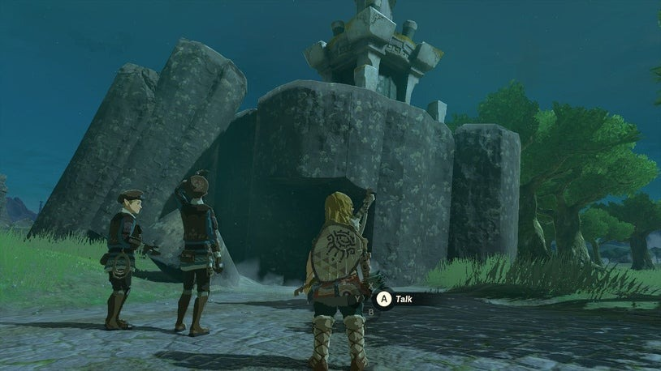
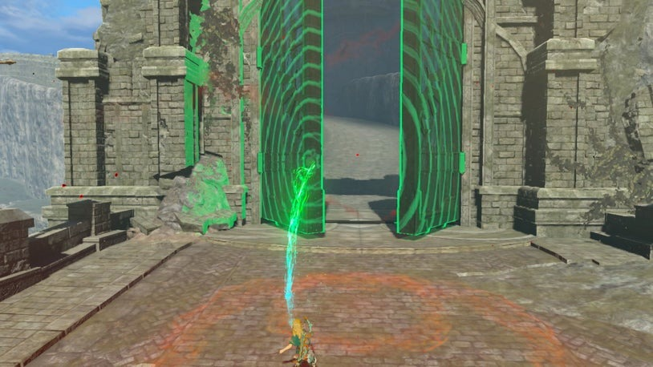
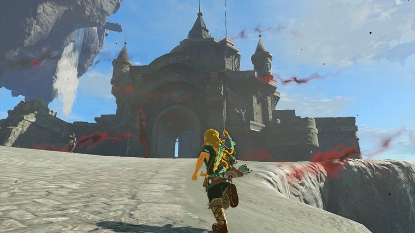
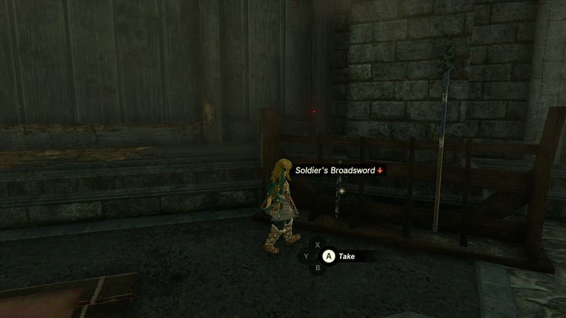
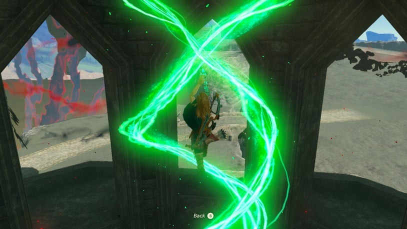
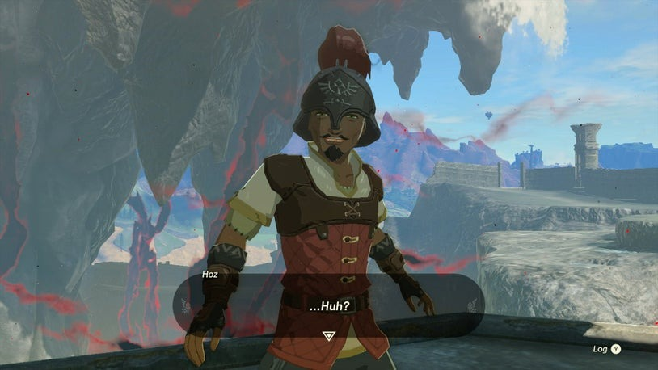

# Crisis at Hyrule Castle - Find Captain Hoz

Now that you have arrived at Lookout Landing, Purah tasks you with informing the captain of the search party about what happened to you and Zelda. Hyrule Castle is mostly in the sky, but a portion remains on the ground near a large chasm. There will be time to explore the landing later.

Exit through the north gate under Purah's observatory. Note the fallen ruin outside the gates where you can find a Steward Construct who upgrades Batteries in exchange for currency. In the Castle Town Ruins, you can help Addison by stabilizing a construction sign using nearby wooden planks. He rewards you with money and items.

{: style="width:100%"}

## Hyrule Castle

Explore the ruins and tents for loot. Interact with the [Kyonosis Shrine](/shrines/Kyonosis) to set it as a fast travel spot and enter for a combat tutorial and Light of Blessing. Use the Ultrahand to open the castle front gate. Wander around the castle, which is mostly in ruin but with fewer enemies. Reach the First Gatehouse and note that metal weapons are less durable due to corrosion. You can increase their durability using certain materials.

{: style="width:49%"}
{: style="width:49%"}
{: style="width:49%"}

## Finding Captain Hoz

To find Captain Hoz, ascend the balconies and speak to him. After updating him on the situation, a vision occurs nearby, prompting a change of plans. Captain Hoz instructs you to report back to Purah. If you wish to explore further, drop down on the other side of the First Gatehouse. Find a broken stone eagle hiding a Korok's pinwheel on a rampart. Travel left to reach the ruined Dining Hall, where you can find valuable items.

{: style="width:49%"}
{: style="width:49%"}

## Returning to Purah 

To get a head start on finding more gear, sprint past Black Horriblins and enter the Guard's Chamber. Loot weapons while remaining undetected, then climb to a high platform to obtain the Royal Guard Outfit from a chest. Return to Purah and give her the news. She will tinker with your Purah Pad and ask you to collect new Map Data.

## Your First Skyview Tower

Rest in the Emergency Shelter underneath Lookout Landing and familiarize yourself with its features and inhabitants. Return to Purah at Skyview Tower, receive the Paraglider, and embark on your test run. Skyview Towers are essential for mapping the region and floating sky islands.

After landing, complete your assignment with Purah and learn about Regional Phenomena appearing around Hyrule. These phenomena are centered around each race's main cities. The recommended order is Rito Village, Goron City, Zora's Domain, and Gerudo Town. However, there are other activities to explore around Lookout Landing.

Take the opportunity to explore Hyrule from the skies and mark points of interest on your Purah Pad. If you're ready to proceed, tackle the Camera Work in the Depths quest first and then investigate the area towards the camera.
