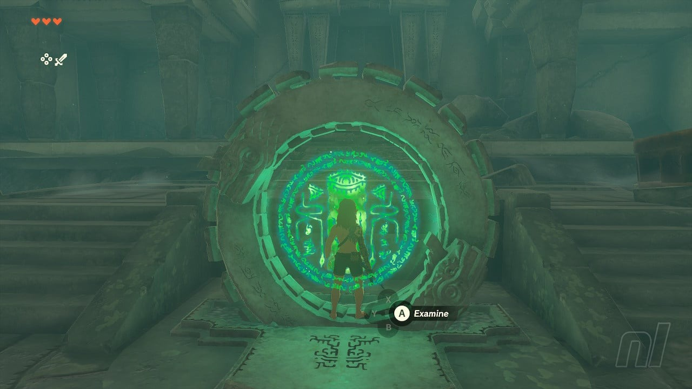
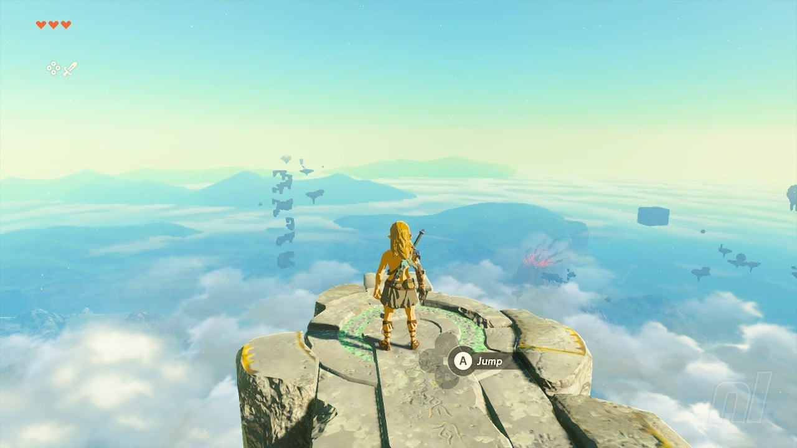
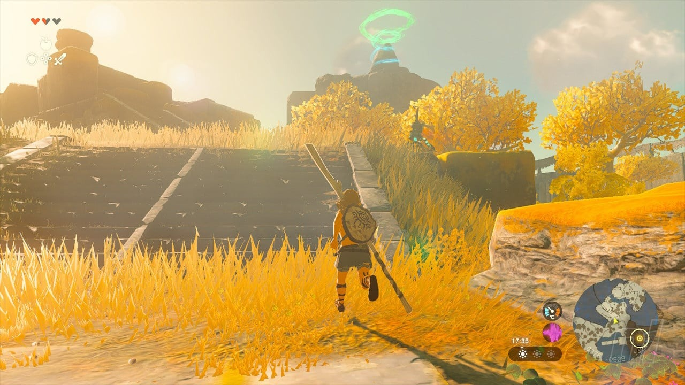
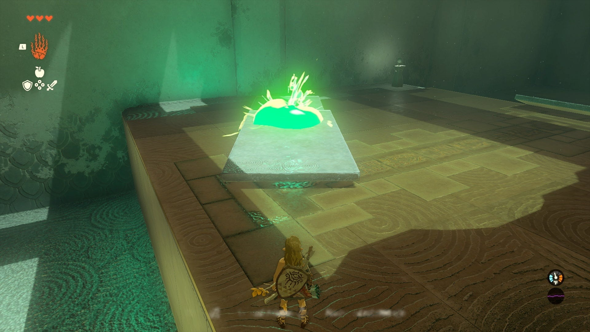

# The Legend Of Zelda: Tears Of The Kingdom - How To Complete The Great Sky Islands

The Great Sky Islands serve as the hub area for the Sky Kingdom and contain the Temple Of Time. This area provides a tutorial for Link's new abilities and mechanics.

## To The Temple Of Time

1. After Link wakes up, proceed through the chamber until you reach the outside.
2. Head directly towards the Temple Of Time, despite potential encounters with hostiles.
3. Once you reach the Temple, a cutscene will play, informing you about the objective.
4. Reach and enter the Ukouh Shrine, located to the left of the Temple.
5. Complete the Shrine test, utilizing the Move ability. Refer [here](/shrines/Ukuoh) for the full shrine guide.

{: style="width:100%"}
{: style="width:100%"}
{: style="width:100%"}

## In-isa Shrine

1. From the first Shrine, continue counterclockwise around the Great Sky Island.
2. Navigate past enemy Soldiers and Archers to reach a wide river that needs crossing.
3. Use the surrounding logs to construct a raft, attaching one of the sails found on the ground.
4. Place the raft in the water and cross the river.
5. Climb the nearby rocks to access the Gutanbac Shrine. Refer [here](/shrines/Ina-isa) for the full shrine guide.

{: style="width:100%"}

## Gutanbac Shrine

1. This Shrine is located at the top of a snowy peak.
2. Proceed counterclockwise from the previous Shrine.
3. Climb the stone archway, taking breaks when necessary.
4. Bring the platform to bridge the gap between the archway and the snowy ground.
5. Ascend the snowy path through a cave, watching out for Like-Likes.
6. Upon exiting the cave, the Shrine will be visible on top of the peak.
7. Use the ladder to climb up, enter the Shrine, and complete the platforming challenge. Refer [here](/shrines/Gutanbac) for the full shrine guide.

## Return To The Temple

1. With all three Shrines completed, Link's arm will gain sufficient power to enter the Temple Of Time.
2. Return to the Temple and proceed inside to witness a vision of Zelda.
3. Zelda will grant Link a special ability and lead him to a sealed door.
4. This door requires literal strength to open, which you currently lack.
5. Proceed to the Nachoyah Shrine, located in [specific location].
6. Use Recall to climb the turbines in the Shrine, following the path to reach the chamber.
7. Complete the Shrine challenge using the provided guide.
8. Exit through the nearby opening and return to the Temple Of Time.

## Finishing the Tutorial

1. Approach the Goddess Statues in the Temple Of Time.
2. Spend the Light Orbs obtained from the Shrines on a new Heart Container.
3. Use your increased health to open the sealed door.
4. Finish the tutorial section.