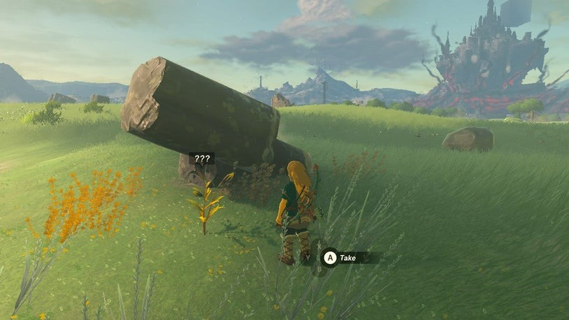
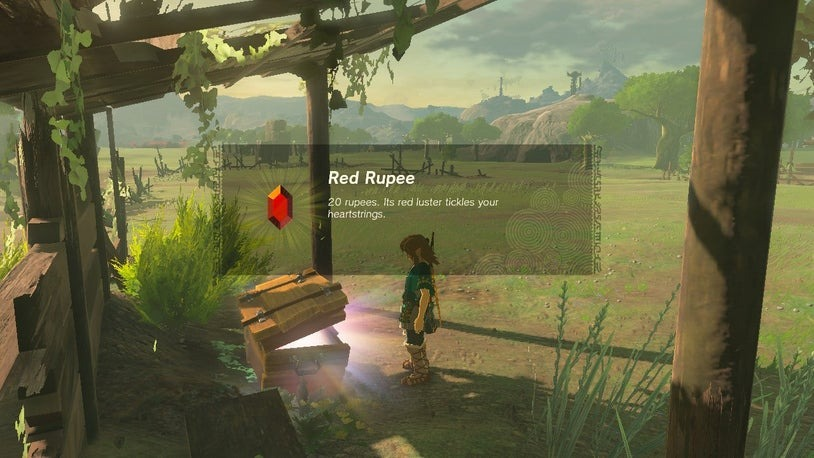

# To the Kingdom of Hyrule

Upon your first arrival back on the surface of the Kingdom of Hyrule, there are a few points of interest to explore as you make your way to the new settlement of Lookout Landing to find Purah.

## Finding Purah

1. Dive through the skies towards the large tower in the distance, but be cautious not to get too distracted as it's recommended to progress the story with important tools.
2. Keep an eye out for fallen debris and rocks from the Sky Islands above that now litter the landscape. These spots often contain materials that can only be found in the sky.
3. The first landmark you'll encounter is the Ranch Ruins, featuring a track, a ruined tower, and debris. Here, you can find a Korok hiding under a rock in the tower and a chest holding 20 rupees under an awning along the track.

{: style="width:100%"}
{: style="width:100%"}

4. Watch out for Bokoblins in the area, as they may carry useful ingredients or elemental fruit that they can throw at you.
5. Proceed beyond the ruins to find the Ranch Ruins Cave, where you'll encounter a new enemy type called Horriblin. Defeat them by shooting them with an arrow to stun them and rush in for the final blow.
6. Before taking the main path up, explore a tiny alcove on the left to find a trove of Brightcap, Brightbloom Seed, a Traveler's Bow, and arrows.
7. Continue along the main path to reach the Horriblin's lair and loot a chest. Look to the right of the cave exit to find another enemy, a Bubbulfrog, that you can defeat for its drop.
8. On the other side of the cave, you'll find the Mabe Village Ruins, where you can scavenge rusty weapons and stock up on arrows by using Ultrahand to lift and drop crates.
9. Spot the group of Bokoblins being led by a Boss Bokoblin in the distance, but consider waiting until you have better weapons and gear.
10. Look for a well on the far side of the broken village, which contains Glowing Cave Fish, Sticky Lizards, Brightcaps, and ore veins hidden within rubble. Break the rubble with makeshift hammer weapons.
11. When you're ready to proceed, head across the field, avoiding the Bokoblin column, and reach the new settlement in front of Hyrule Castle Town, known as the Sacred Ground Ruins.
12. Interact with the people and talk to Purah, the Sheikah Tribe's foremost researcher of ancient tech, who will give you urgent tasks to complete.

## Crisis at Hyrule Castle - Find Captain Hoz

Continue following the guide to progress through the game and complete the next quest.