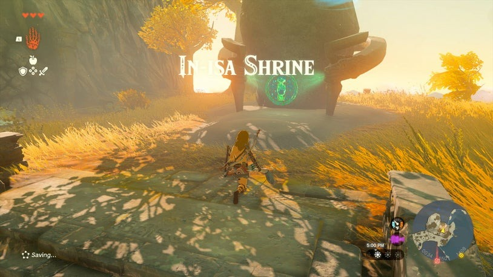
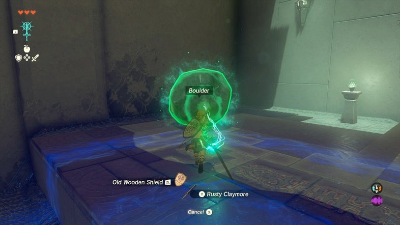
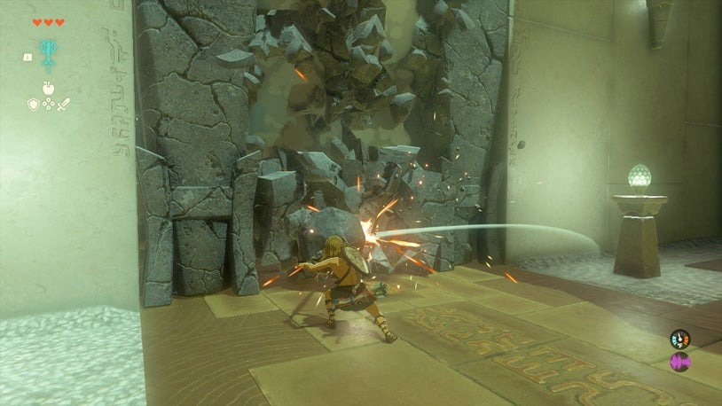
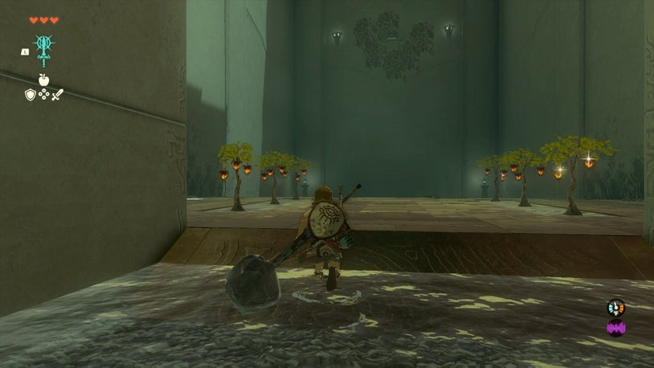
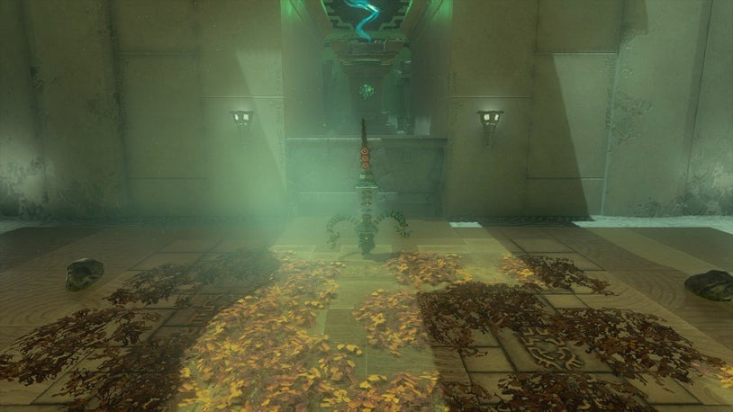
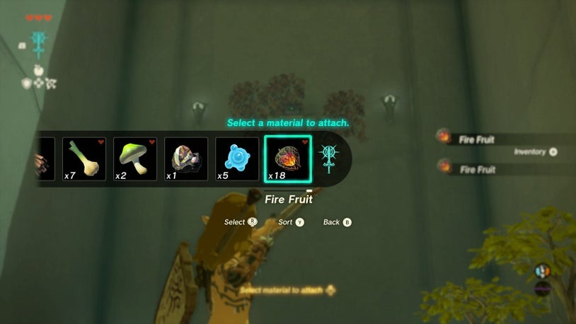
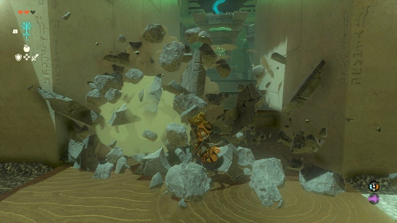

# In-isa Shrine

## Location and Introduction
The In-isa Shrine is one of the many shrines found in The Legend of Zelda: Tears of the Kingdom. It is situated on the Great Sky Island, requiring completion of a quest to access it. Inside the shrine, you will encounter Rauru, who bestows upon you the powerful ability called Fuse. This unique ability allows you to meld objects with your weapons, creating formidable fused creations that enhance attack power, durability, and can even modify weapon properties.

{: style="width:100%"}
## Puzzle Solutions
1. As you venture into the shrine, you will encounter crumbling stone pillars blocking your path. Utilize the Fuse ability to merge a boulder with your weapon, resulting in a Broadsword Hammer. Equipped with this fused weapon, you can now break apart rocks and effectively use it as a mining tool.

{: style="width:100%"}
2. Destroy the gate and progress to the next room. Within this room, there are four pillars. By employing your fused weapon, you can demolish one of the pillars that holds a chest atop it. Destroy the pillar to obtain the contents of the chest.

{: style="width:100%"}
3. On the right side of the room, there is a high wooden platform surrounded by leaves. Take out your bow and activate the Fuse ability. Select the Fire Fruit, and witness its fusion with your arrow, transforming it into a fire arrow. Launch the fire arrow to ignite the wood, causing the chest on the platform to descend. Open the chest to claim its valuable contents.

{: style="width:100%"}
4. Proceed through the shrine using the key acquired from the chest. Eventually, you will enter an arena where you will face off against a formidable opponent, the Soldier Construct Captain. This advanced construct possesses the Fuse ability as well, fusing nearby objects onto its weapons. However, you can also utilize this ability to your advantage. Look for a ladder on the left side of the arena, providing access to various items suitable for fusion. Experiment with different combinations, such as attaching thorns to your shield for increased damage or fusing a wooden stick to transform it into a spear. Alternatively, you can strategically use the Fire Fruit to ignite the dried leaves around the arena, causing damage to the Construct.

{: style="width:100%"}{: style="width:100%"}
5. Defeat the Soldier Construct Captain and employ a weapon fused with a rock or boulder to break down the final gate, leading to the Light of Blessing.

{: style="width:100%"}
## Treasure Chests
- Throughout your exploration of the In-isa Shrine, keep an eye out for treasure chests containing valuable items. One notable chest can be obtained by fusing the Fire Fruit with your arrow and igniting the wooden platform, causing the chest to descend.
