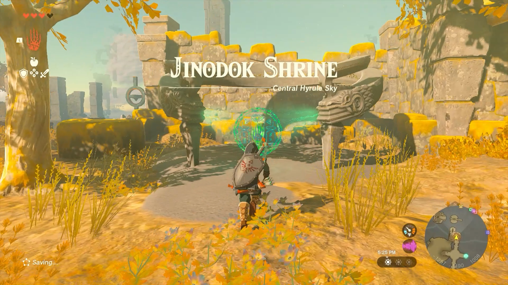
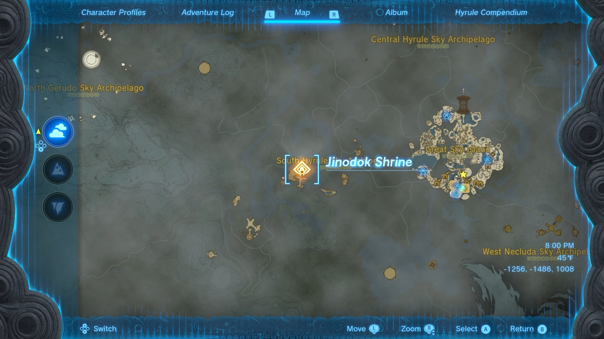
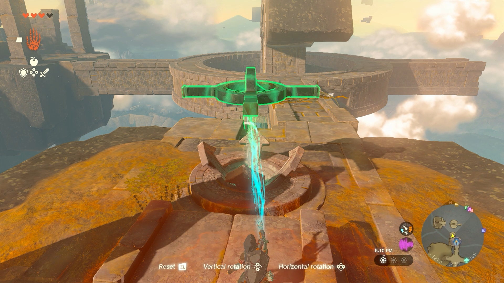
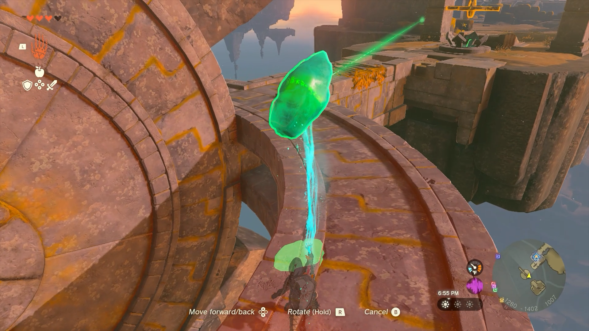
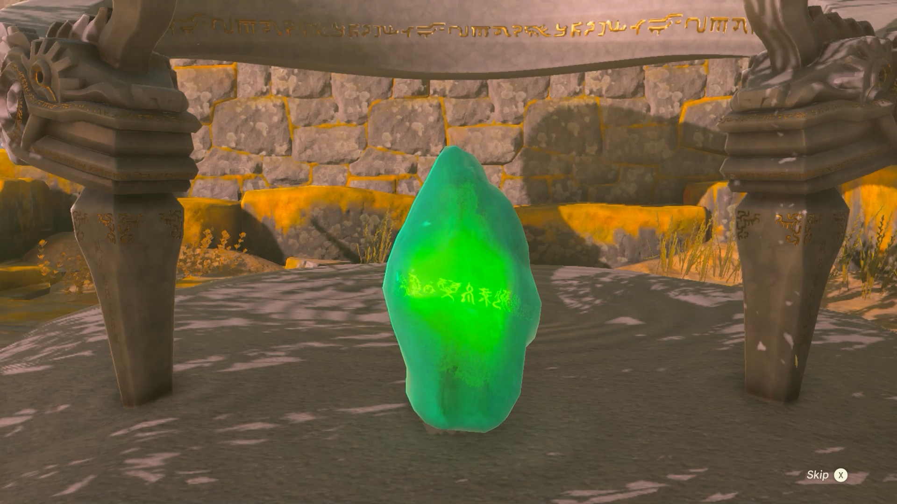
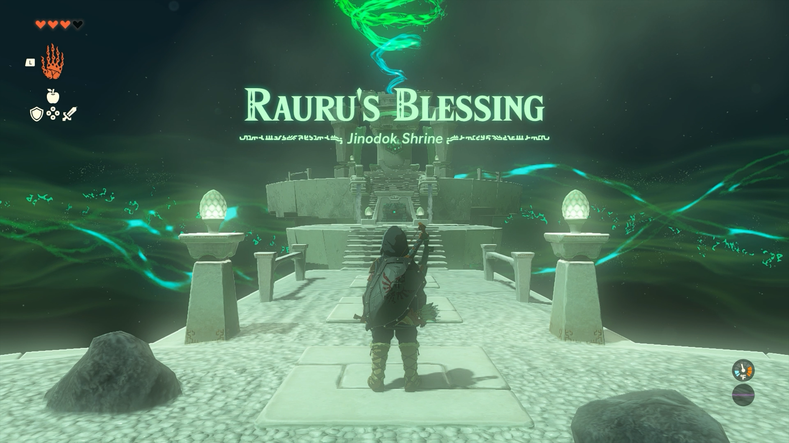

# Jinodok Shrine

## Location and Introduction

{: style="width: 100%"}

{: style="width: 100%"}

Jinodok Shrine, also known as Rauru's Blessing, is a shrine located on a sky island in the Central Hyrule Sky region. To access the shrine, you must first complete The South Hyrule Sky Crystal shrine quest.

Jinodok Shrine is situated in the South Hyrule Sky Archipelago, west of Great Sky Island. In order to reach the shrine, you need to follow a series of steps. 

1. Begin by approaching the shrine's location and activate the green hand to receive instructions. 

{: style="width: 100%"}

2. A green beam of light will guide you towards the sky crystal. Use Ultrahand to rotate the floating shape that matches the sky island in front of you. 

{: style="width: 100%"}

3. Align the shape in such a way that it creates connecting pathways between the sky islands. This will enable you to walk across the paths and reach the sky crystal.

{: style="width: 100%"}

Once you have successfully obtained the sky crystal, carry it back to the shrine's location. As you bring the sky crystal to its rightful place, Jinodok Shrine will appear before you.

{: style="width: 100%"}

## Puzzle Solutions

Reaching the shrine is the puzzle itself. This shrine offers no puzzle inside.

## Treasure Chests

Diamond: There is a treasure chest located at the top of the stairs.
