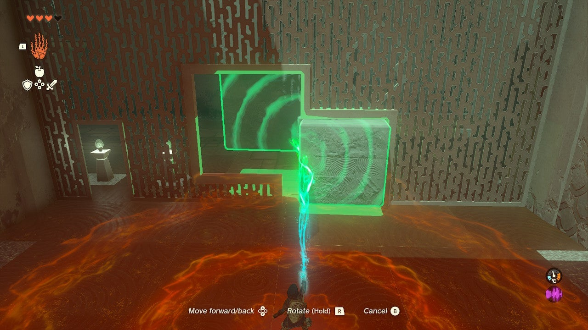
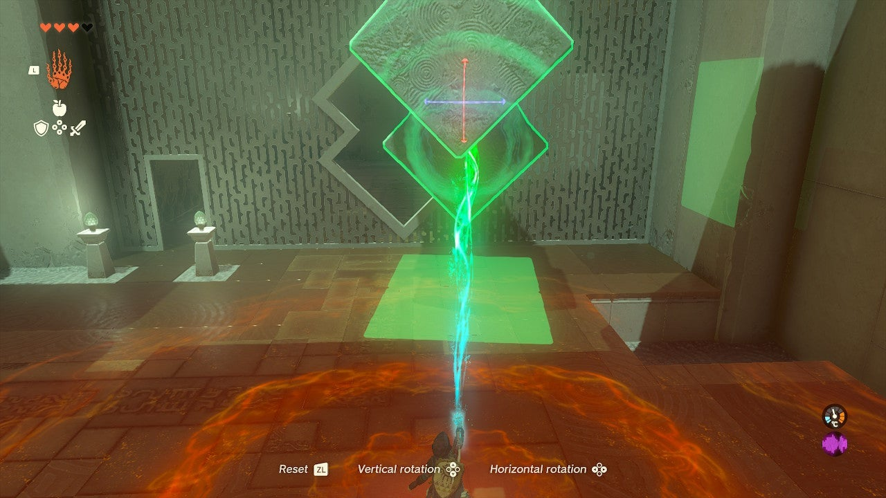

# Jiosin Shrine

## Location and Introduction

Jiosin Shrine, known as "Shape Rotation," is a shrine located in Central Hyrule Region. It can be found on the ground, south of Lookout Landing. This shrine presents a series of puzzles that involve manipulating different shapes and blocks to progress.

## Puzzle Solutions

1. Upon entering the shrine, you'll find a room to the left with a long piece of stone in an X shape on its side and a hole in the wall with a similar shape. To proceed, equip the Ultrahand by pressing and holding the L button. Tap the L button to highlight the X block, then lift it into the air. Run around the room while holding the block and push it through the X-shaped hole. You can rotate the block in mid-air by pressing the R button and using the D-pad. Pick up the X block again in the next room and use the R button to rotate it so that the X is towards Link. This creates a bridge that you can cross. Note the green shadow cast by the X block to align it with the bridge. Use the ladder to exit the chasm.

2. In the next area, turn right and you'll find two cubes fused into a new shape. Pick up the double cube block and bring it to the gap. Hold the R button and rotate the blocks until they can fit through the hole. Experimentation may be needed, but they can fit in the configuration shown. Before proceeding to the final room, observe the wall between the rooms with the double cube holes. You'll notice platforms and a chest above them. Turn the double cube on its side and place one cube in the divot beneath the platforms. This allows you to climb the blocks and reach the platforms with a treasure chest containing a "Hasty Elixir."

3. Across the room, there is another wall with a hole. Use the R button rotation again to spin the block to fit through the hole as shown in the picture. Drop the block next to the platforms leading to the glowing shrine exit. Nestle one block behind the platform in the gap. You can either drop the double cube on its side and jump up it, then jump the gap, or select Ascend with the R button to travel up through the block vertically. From there, leap to the platform and exit the shrine.

## Treasure Chests

- Hasty Elixir: Found on the platforms above the double cube puzzle area. Climb the blocks and jump across the gap to reach the platforms with the chest.

