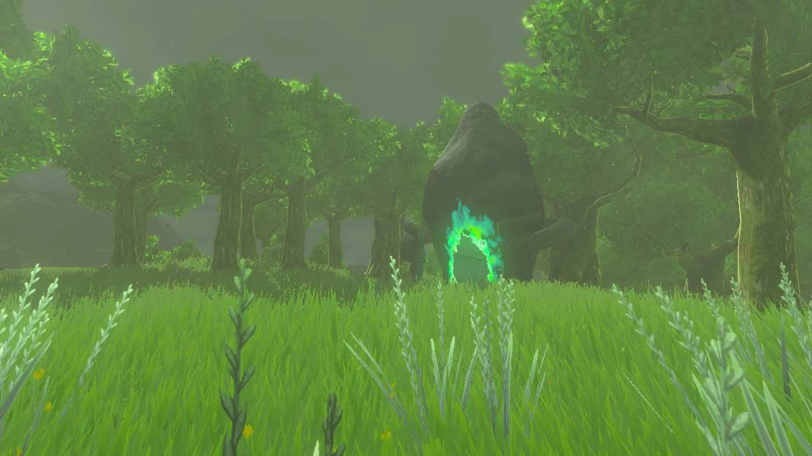

# Kamizun Shrine

## Location and Introduction

The shrine is nestld in the trees west of the East Post Ruins, just north of the road.

{: style="width: 100%"}
{: style="width: 100%"}

## Puzzle Solutions

1. Kamizun Shrine presents a Proving Grounds challenge where all your materials, equipment, and food are temporarily removed. Instead, you must utilize the provided resources and abilities.

{: style="width: 100%"}

2. Upon entering the challenge room, you will encounter four Zonai Soldier Constructs that you need to defeat. Use Ultrahand to interact with various objects in the room, such as a barrel behind a pillar on the right, a large stone on the left, a spike ball near the constructs in the middle, and a fire fruit plant on the far left to create fire arrows.

{: style="width: 100%"}

3. Since you have limited resources, make sure to strategize and make each shot count. It is recommended to take out the soldier construct on the right that stands atop the platform first to avoid constant arrow attacks while facing the others. It takes around four arrows to defeat it.

{: style="width: 100%"}

4. Alternatively, you can employ a stealth approach by moving slowly with the boulder and Ultrahand, allowing you to reach the Fire Fruit without being detected.

{: style="width: 100%"}
{: style="width: 100%"}

5. Once all four constructs are defeated, your items will be returned to you. Proceed through the gate to obtain the shrine's treasure, the Spring Shield, and collect your Light of Blessing.

## Treasure Chests

- Spring Shield: Located in the shrine, obtained after completing the challenges.

{: style="width: 100%"}
