# Kyokugon Shrine

## Location and Introduction

Kyokugon Shrine is a shrine located in the Central Hyrule Region, specifically under Hyrule Field's Great Plateau. Head to the Forest of Spirits around the Great Plateau. You may receive a constant notice that a Shrine of Light is nearby.

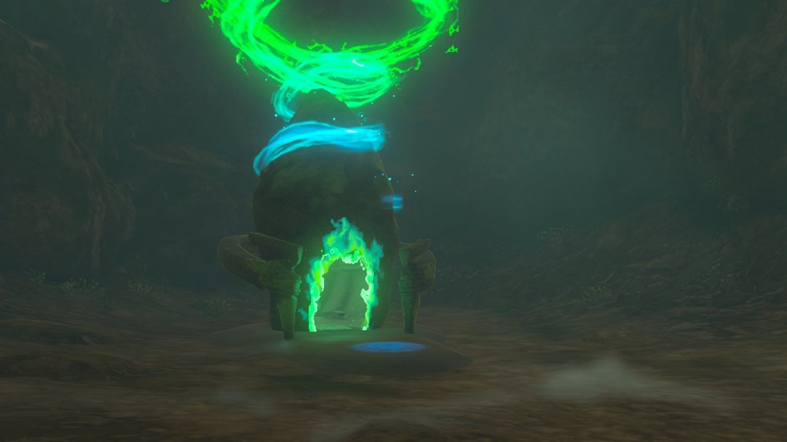{: style="width: 100%"}
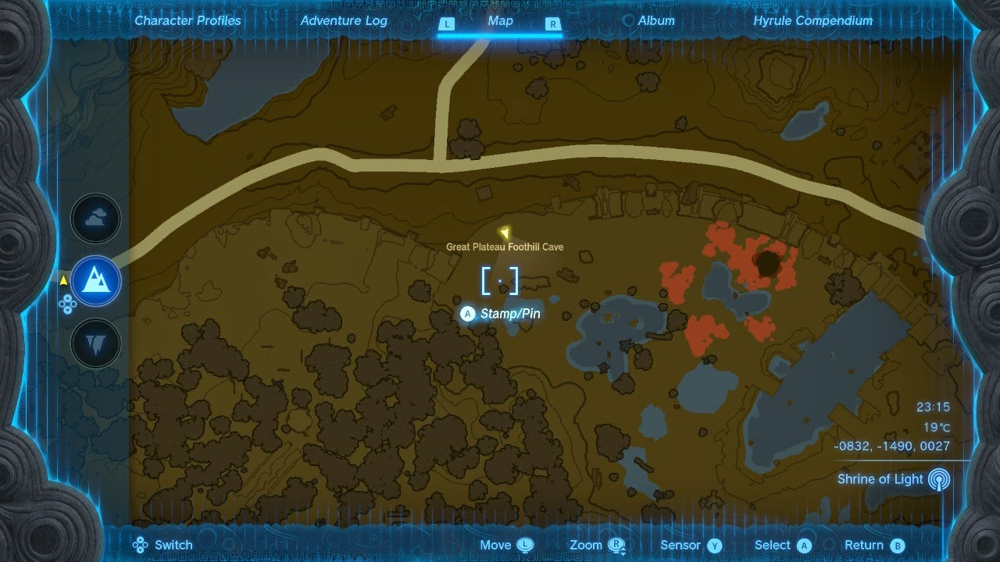{: style="width: 100%"}

## Puzzle Solutions

To navigate and solve the challenges in Kyokugon Shrine, follow these steps:

1. Look for a cave under the plateau near Addison and the Hyrule Restoration Materials platform. You can access it by destroying the red rock wall using bomb plants or a rock hammer.

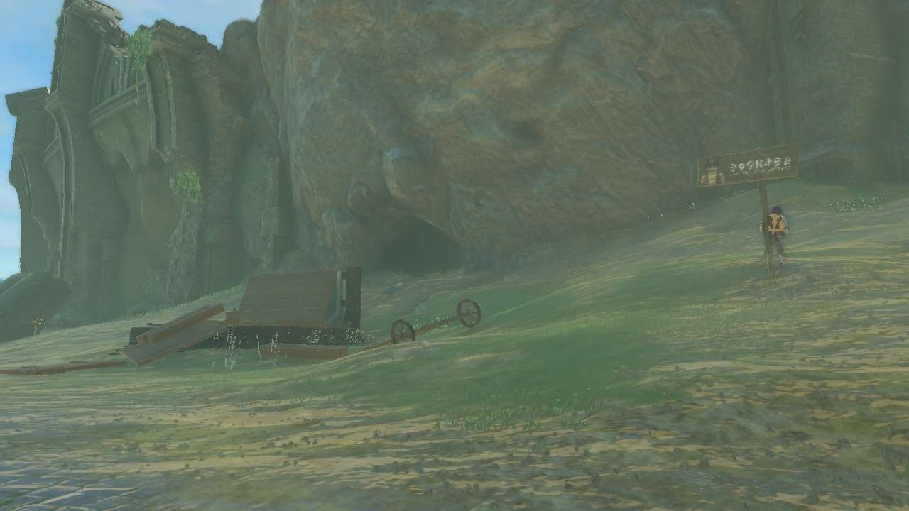{: style="width: 100%"}
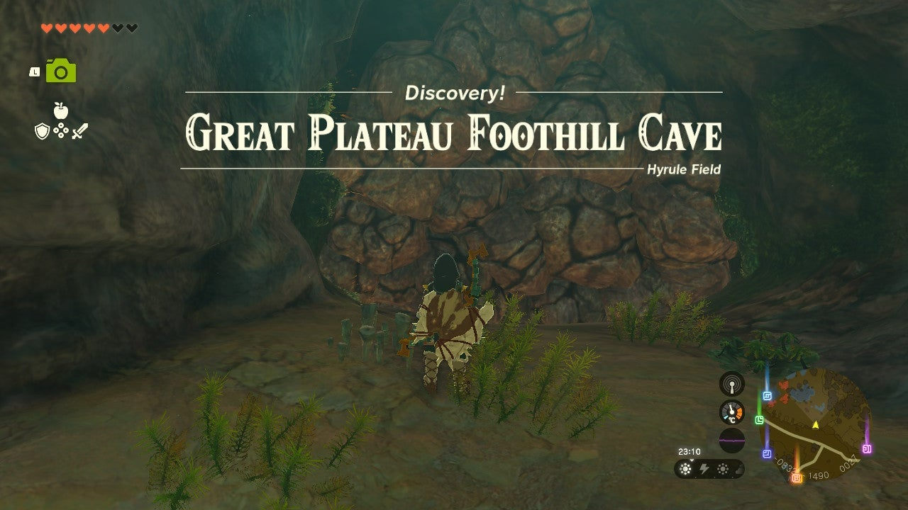{: style="width: 100%"}

2. Enter the Great Plateau Foothill Cave, which is an open cavern filled with brightbloom seeds, luminous stone, and two Horriblins. Defeat the enemies and proceed further.

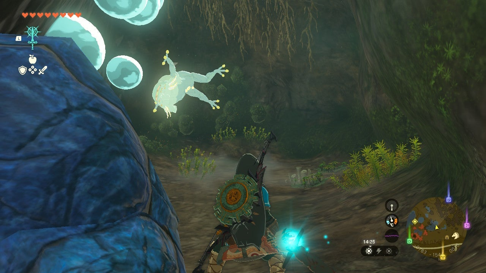{: style="width: 100%"}

3. Destroy the next blue rock wall on the right side of the path, followed by the grey rock wall. The blue wall on the right side is easier to clear. Behind the grey rock wall, you'll find a Bubbulfrog.
4. Return to the main path and destroy the dense grey rock wall. It may require multiple uses of a rock hammer.
5. Once you've cleared the way, you'll reach the Kyokugon Shrine located in a large cavern.

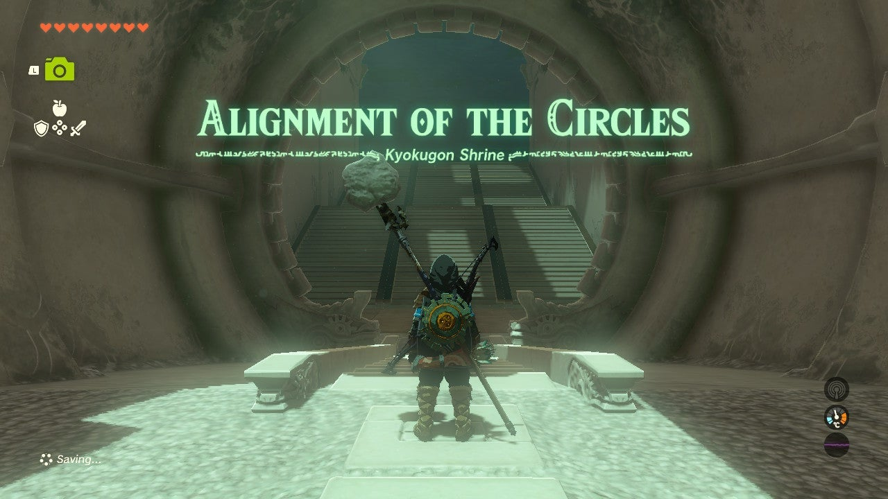{: style="width: 100%"}

6. Inside the shrine, you'll find a large room with four ball ports arranged in a diamond shape in the center. There are three additional ports on varying levels to the left and right of the center. However, you only have four balls.

7. The solution to the shrine lies on the ceiling. Look above the room to find four green circles that indicate which ports should have a ball. Place the balls in the designated spots to open the gate.

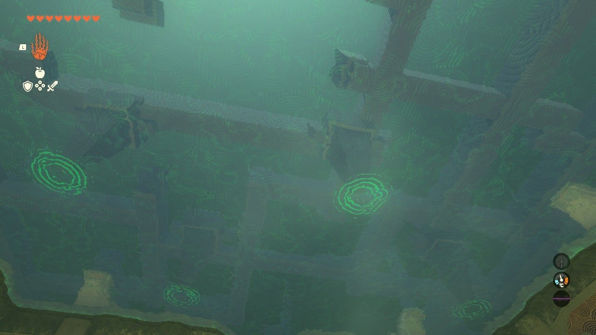{: style="width: 100%"}

8. After solving the puzzle, the gate will open, leading to the exit and the shrine's treasure chest.

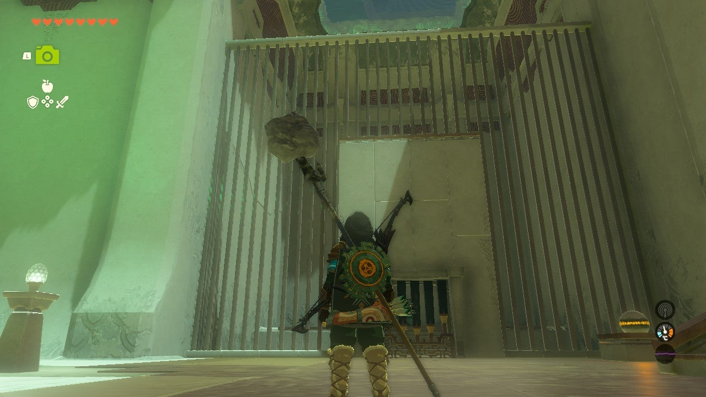{: style="width: 100%"}

9. In the exit room, you'll encounter another large gate. To unlock it, grab the ball located to the right of the gate. Look up at the ceiling to find another green circle to the left of the shrine exit. Use Ultrahand to remove a panel in the floor and reveal a ball port. Deposit the ball in the port to open the gate.

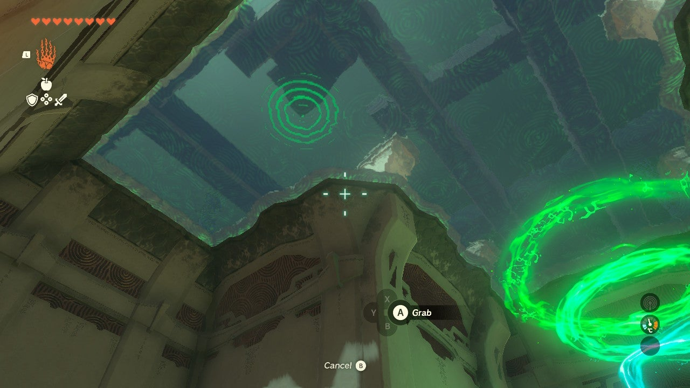{: style="width: 100%"}
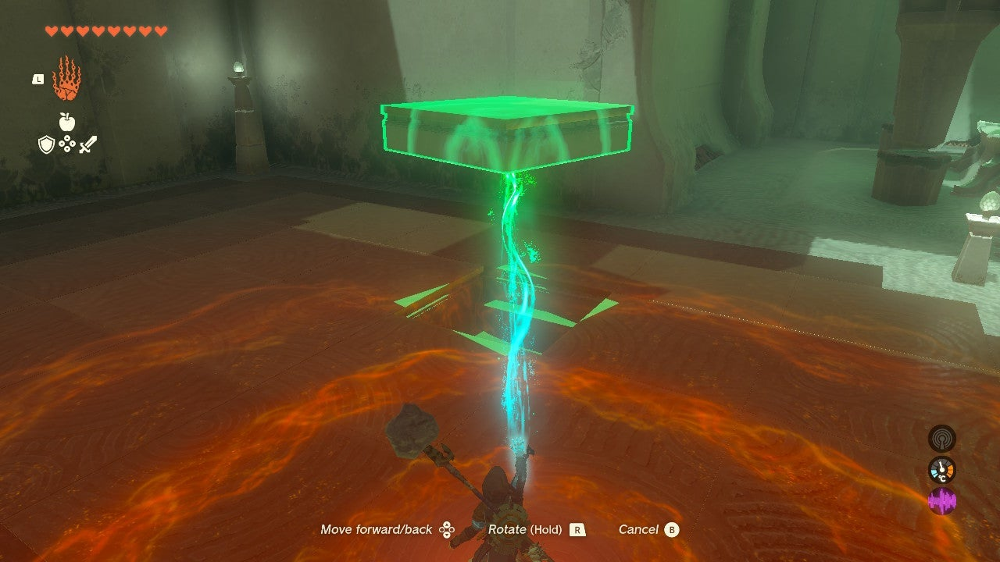{: style="width: 100%"}
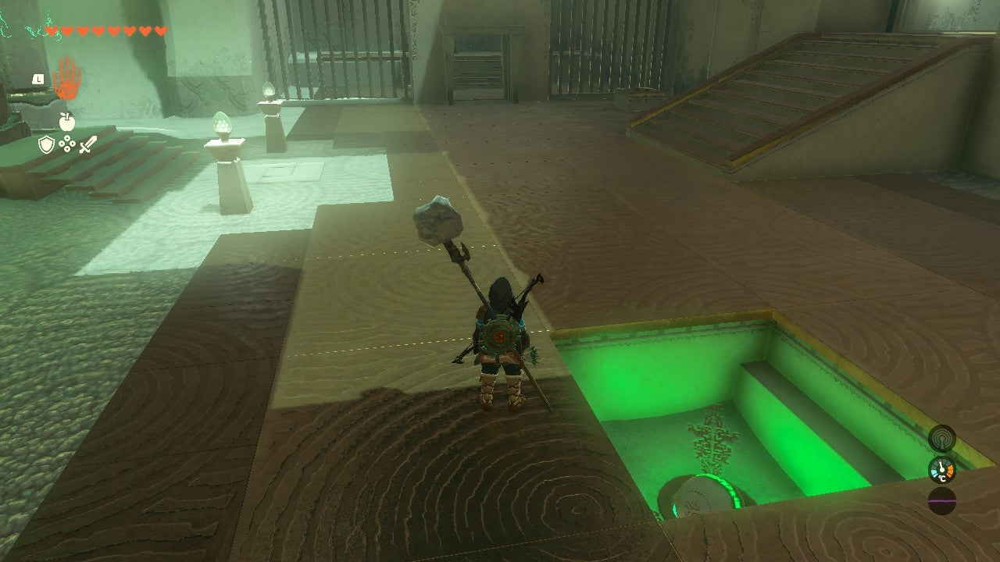{: style="width: 100%"}

10. Inside the treasure chest, you'll find a Hearty Elixir. Proceed to the exit to collect your Light of Blessing.

## Treasure Chests

- Hearty Elixir: Found in the shrine's treasure chest after unlocking the final gate.
