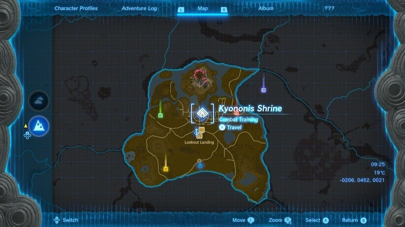
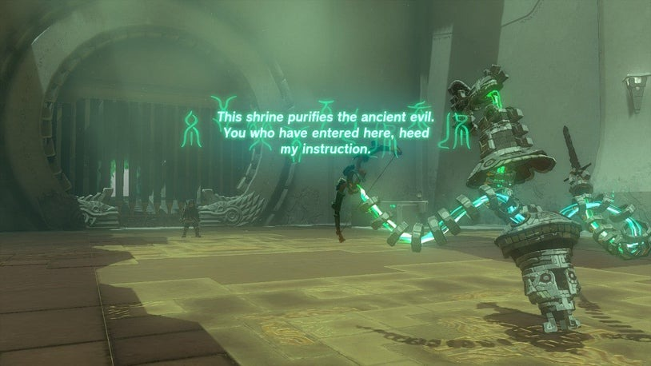
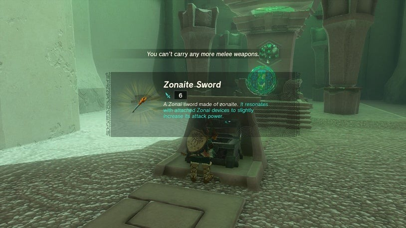

# Kyononis Shrine

## Location and Introduction
It is located in Central Hyrule, just north of Lookout Landing. The shrine is easily visible on the ground. Be sure to bring one-handed weapons, even a simple stick will suffice for the combat training inside the shrine.

## Puzzle Solutions
1. Enter the Kyononis Shrine and approach the construct in the center of the arena.
2. This shrine serves as a Combat Training shrine, focusing on Perfect Dodge and Perfect Guard counterattacks.
3. During the tutorial, no damage will be dealt to you, so there's no need to waste arrows or items.
4. Pay attention to the instructions and practice the Perfect Dodge and Perfect Guard techniques.
5. Once you complete the Combat Trial, collect the items dropped by the construct as a reward.
6. Exit the shrine and near the exit, you will find the treasure chest containing a Zonaite Sword.

## Treasure Chests
- Upon completing the Combat Training shrine, you won't have to search for a hidden treasure chest. It is conveniently located near the exit. Inside, you will find a Zonaite Sword.

