# Mayachin Shrine

## Location and Introduction

Mayachin Shrine is a challenging shrine located in the Central Hyrule Region in The Legend of Zelda: Tears of the Kingdom. It is known to be one of the hardest shrines to complete. This guide will provide you with the necessary steps to locate and enter the shrine and help you navigate its tricky challenge.

Coordinates: 0705, -0865, 003

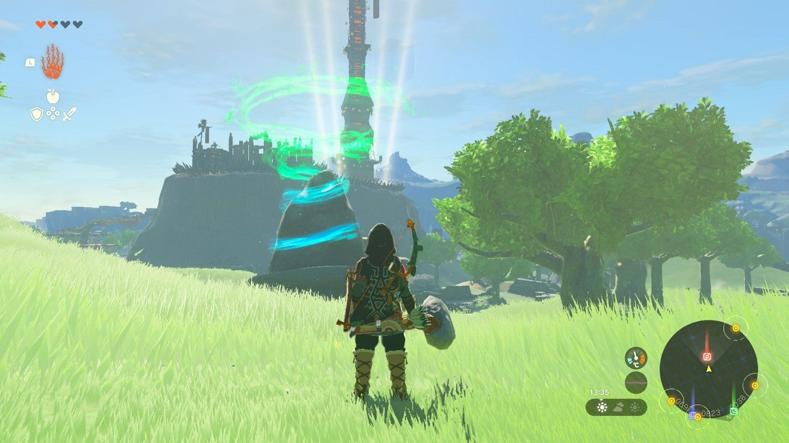{: style="width=100%"}
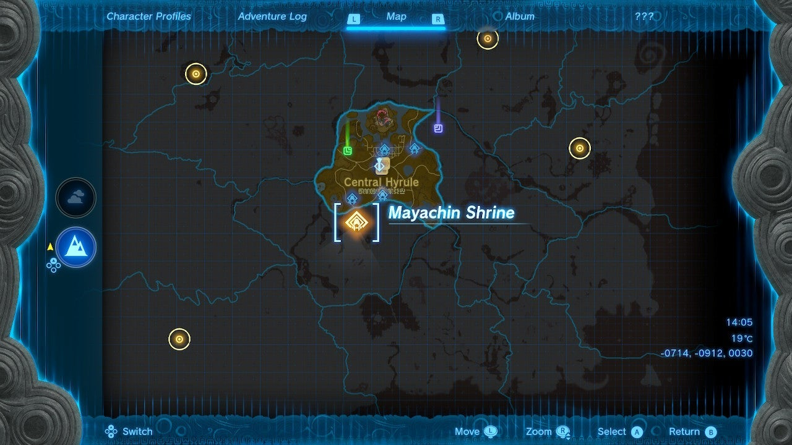{: style="width=100%"}

## Puzzle Solutions

To conquer the Mayachin Shrine, follow these steps:

1. Locate the shrine on the surface, just north of Hyrule Field Skyview Tower in the Exchange Ruins, which is situated south and west of Lookout Landing.
2. The main objective of this dungeon is to create a baseball bat and hit two large orange targets. One target on the left opens the path forward, while the other on the right unlocks the treasure chest.
3. Carefully hop across the rotating platform and step on the ground pressure switch.
4. The column to the left functions as a switch to rotate a pivot below you, where a large ball rolls past. Use a weapon to activate the switch.

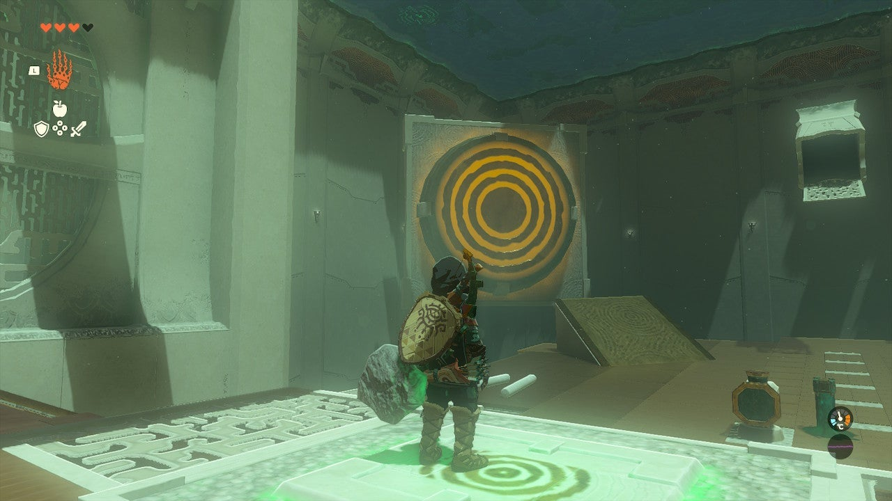{: style="width=100%"}
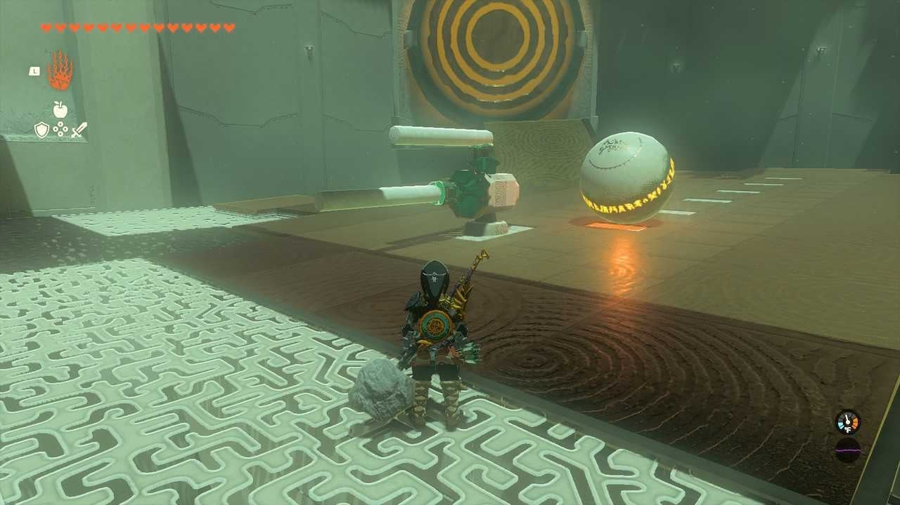{: style="width=100%"}

5. Build your bat by removing a spike from the ground and pressing it into the large octagon-shaped side of the object sticking out of the ground. Attach one of the round poles to the end of the spike.

{: style="width=100%"}
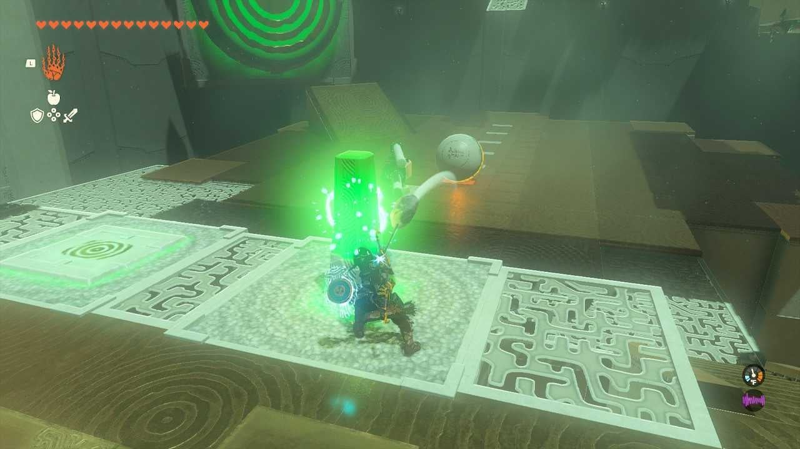{: style="width=100%"}

6. There are various ways to construct your bat. The provided options are the ones used to hit the center of the target successfully.
7. Observe the colored strips on the ground that the ball rolls over. Depending on the type of bat you built, return to the orange switch and time your hit to strike the target as the ball reaches the second-to-last strip on the ground. It may take a few attempts, but even hitting the tip of the orange target will open the path forward. Another target will be revealed.

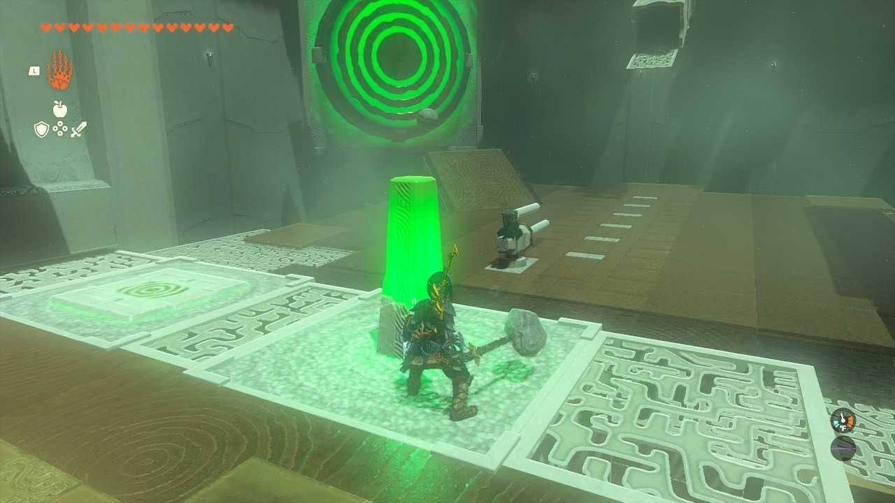{: style="width=100%"}
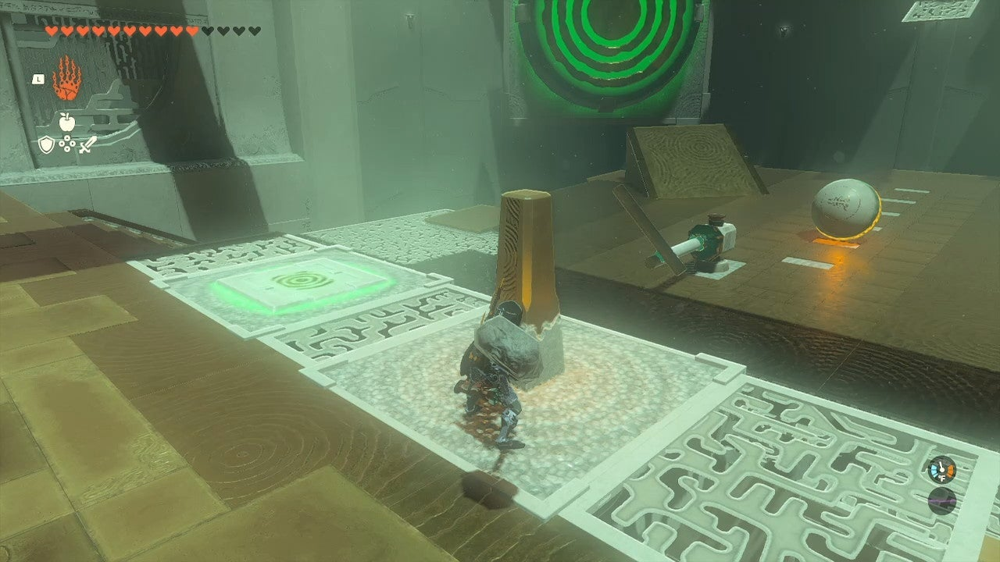{: style="width=100%"}

8. The treasure chest is located in a locked cage across from the shrine's exit. After activating the first target on the left, a secondary target on the right will rotate. Hit the secondary target to unlock the door to the treasure chest.
9. Deal with the hanging board obstacle by using the spike near it. Press the spike into the ceiling above the hanging board. Utilize the Ultrahand to rotate the board and attach it to the spike hanging from the ceiling.
10. Depending on your bat's construction, either reverse your build or swing again to hit the target. Alternatively, you can build a long stick, attach the ball to the end, touch the targets with it, and then use the recall feature to bring it back to a safe landing spot.

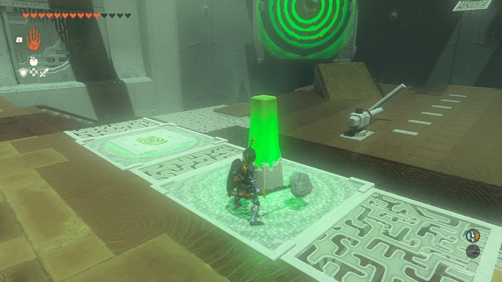{: style="width=100%"}
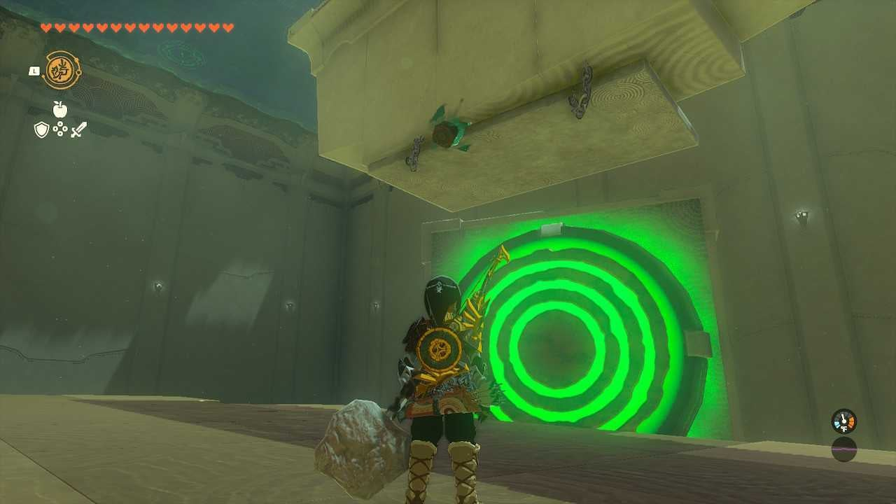{: style="width=100%"}
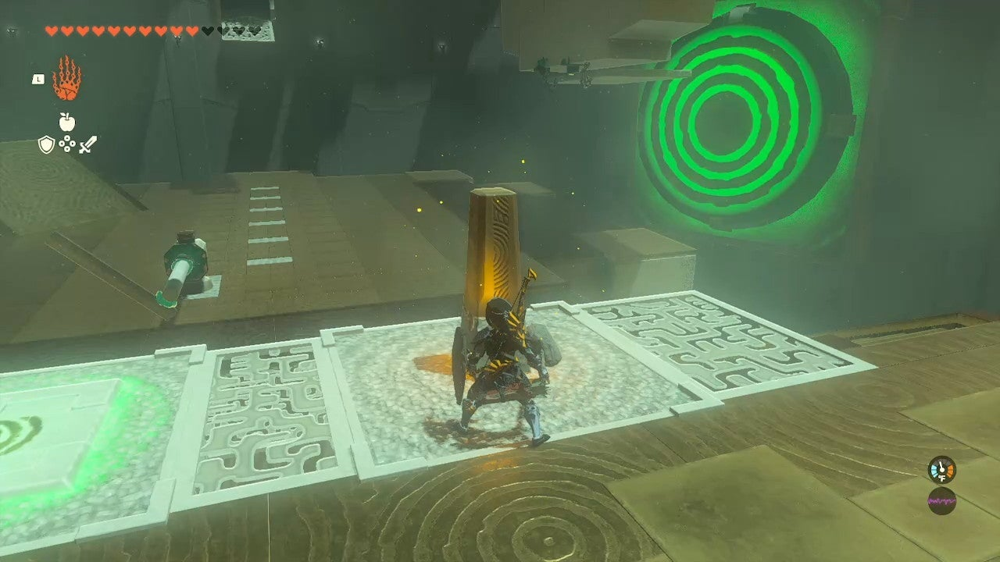{: style="width=100%"}
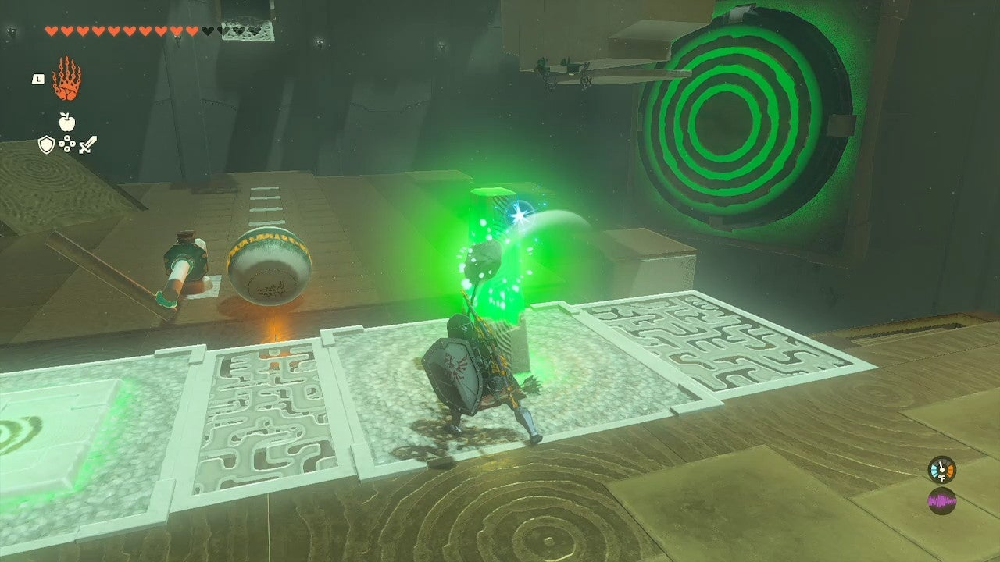{: style="width=100%"}
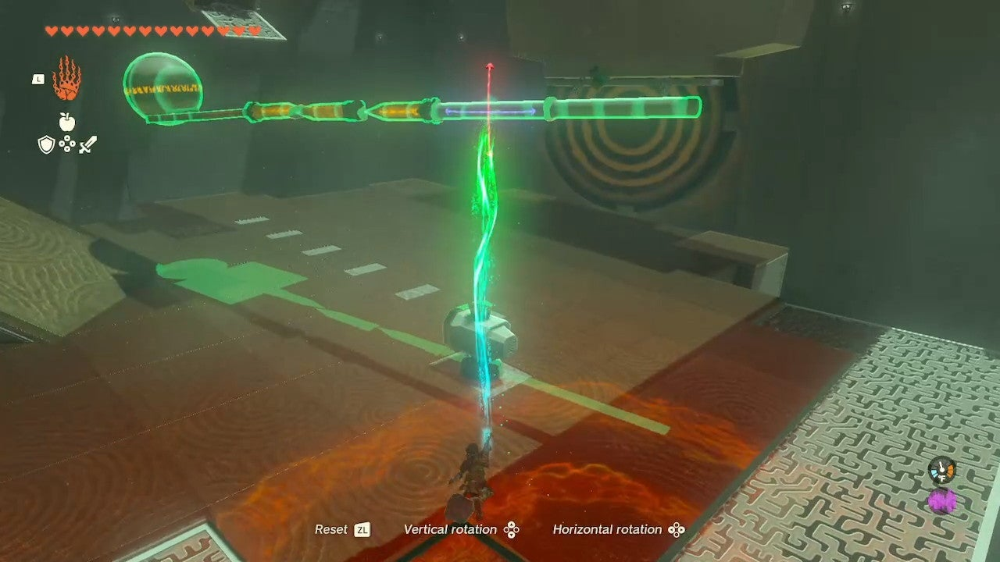{: style="width=100%"}
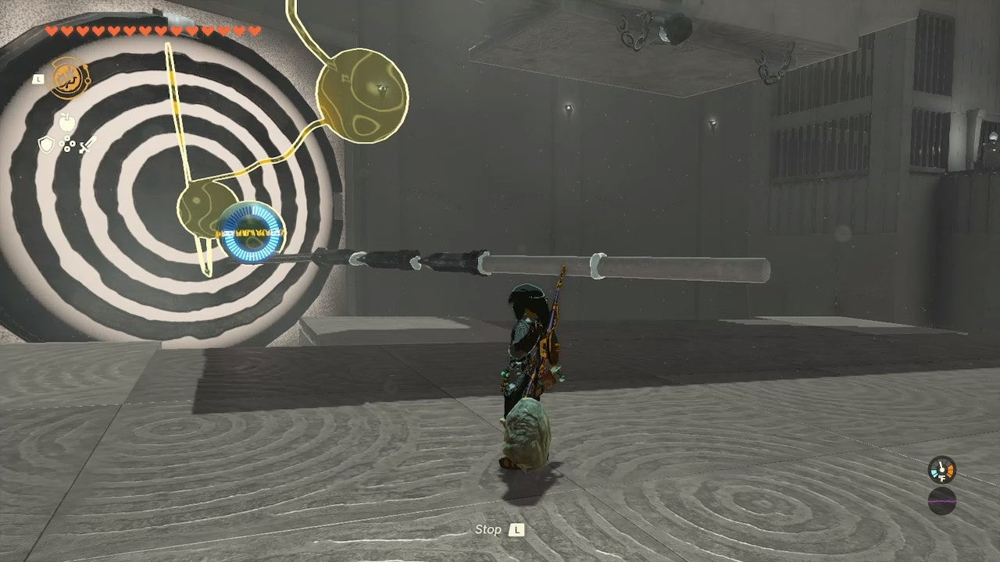{: style="width=100%"}

11. Inside the cage, you will find an Energizing Elixir in the treasure chest.

12. Exit the shrine across from the treasure chest.

## Treasure Chests

- Energizing Elixir: Found in a locked cage across from the shrine's exit. Hit the secondary target on the right to unlock the door and access the treasure chest.

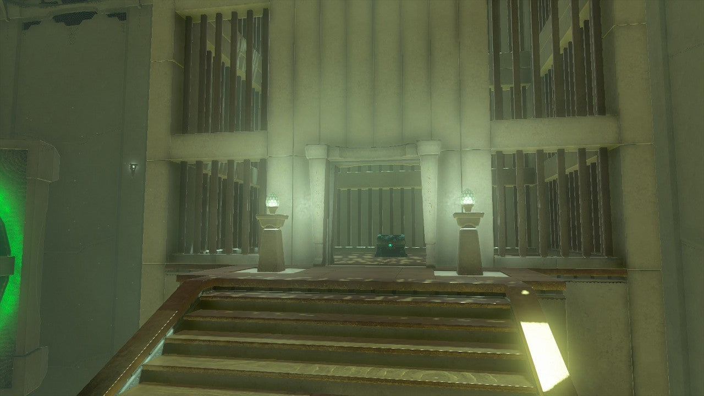{: style="width=100%"}