# Mayam Shrine

## Location and Introduction

Mayam Shrine, also known as Rauru's Blessing, is one of the 152 shrines in The Legend of Zelda: Tears of the Kingdom. It is located on an island in the North Hyrule Sky Archipelago. This guide provides information on how to locate and enter the shrine, details about the shrine quest, puzzle solutions, and information on treasure chests.

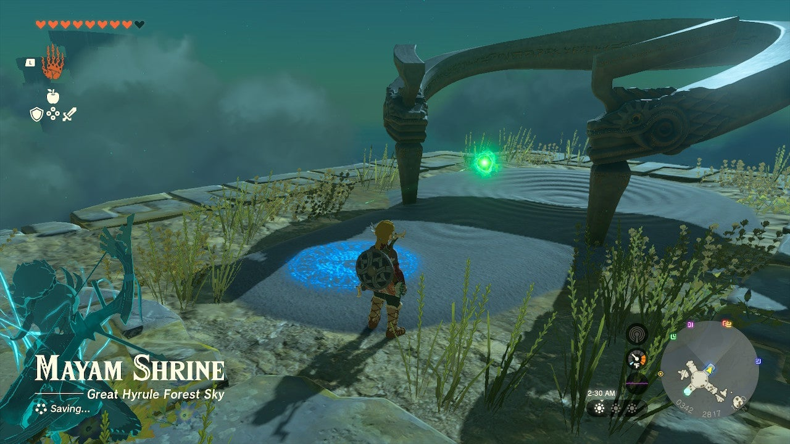{: style="width: 100%"}
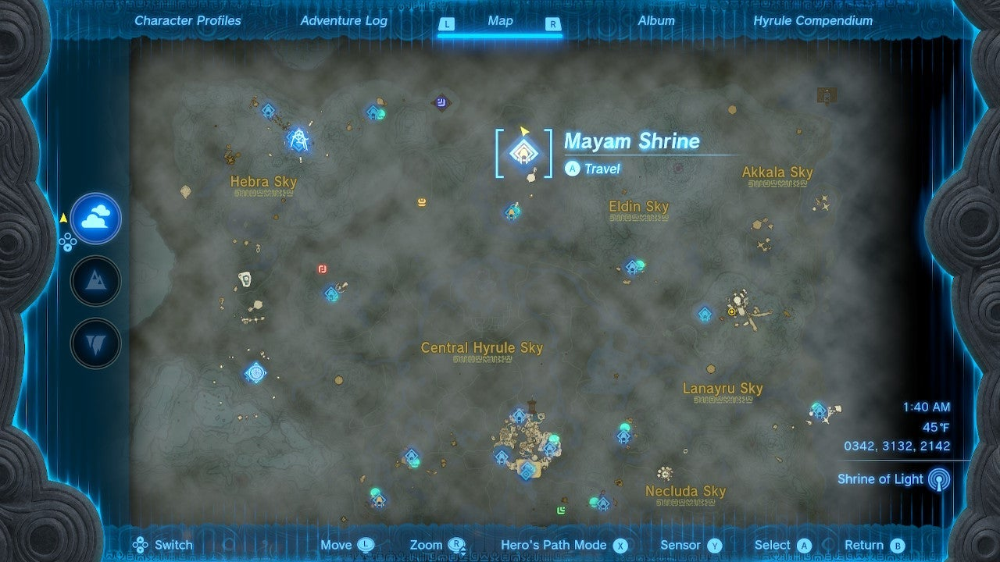{: style="width: 100%"}

To activate Mayam Shrine, you need to complete the Shrine Quest, "The North Hyrule Sky Crystal Shrine Quest." Start by launching into the air from Thyphlo Ruins Skyview Tower and floating south to the cross-shaped island. Activate the shrine pad on the island to begin the quest.

To open the Mayam Shrine, you must return a green crystal to its shrine activation pad. Follow the green laser, which conveniently points the way to the crystal located on a large, flat island below. Be cautious of the enemy lurking there, as it can be challenging to defeat. It is recommended to save your game before attempting this.

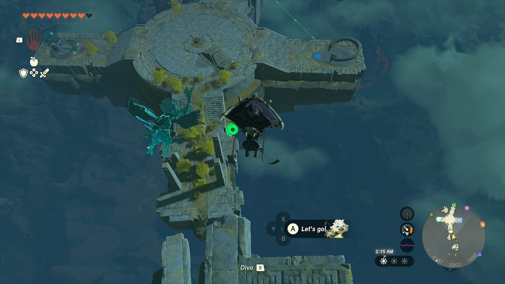{: style="width: 100%"}

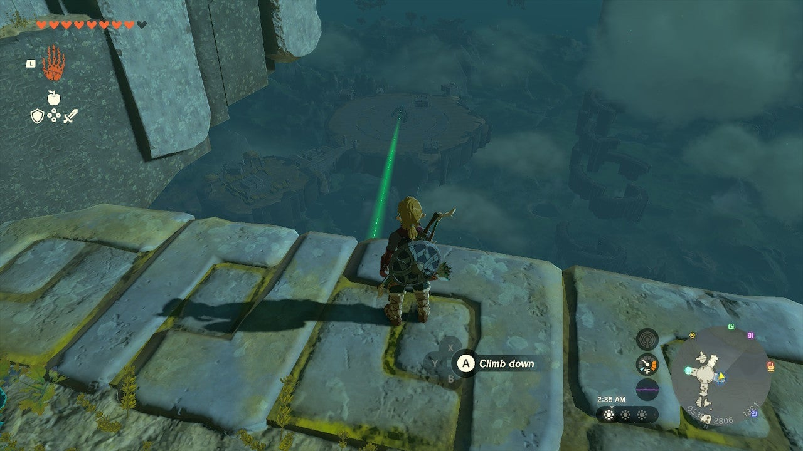{: style="width: 100%"}

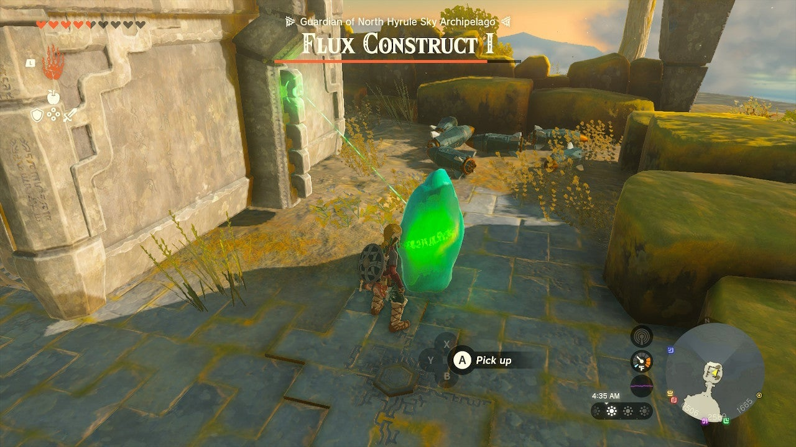{: style="width: 100%"}

Float down to the island from the north end, away from the enemy. Your objective is to create an escape vehicle using rockets. Stack the rockets on a single floating pad without attracting the enemy's attention. If spotted, hide for a while. You will need at least two rockets, but it's advisable to attach only one rocket initially, as there should already be one attached. The remaining rockets should sit unattached on the surface of the pad.

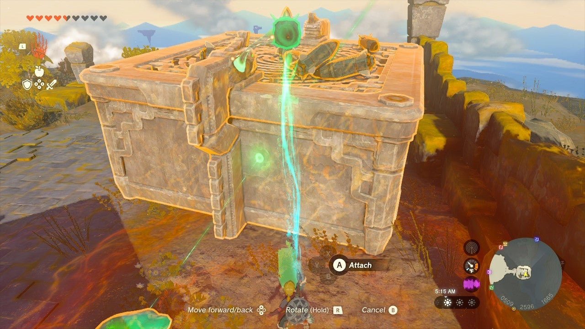{: style="width: 100%"}

Approach the Flux Construct, an enemy guarding the crystal. You can choose to fight it or use the Ultrahand to steal the glowing cube by selecting it and wiggling the RIGHT STICK. If you decide to fight, attack the cube with your best weapons. However, it is not necessary to defeat the enemy. Instead, steal the green cube once and retrieve the green crystal from the rubble. Run to your escape ship, ensuring that you connect the crystal to the floating pad.

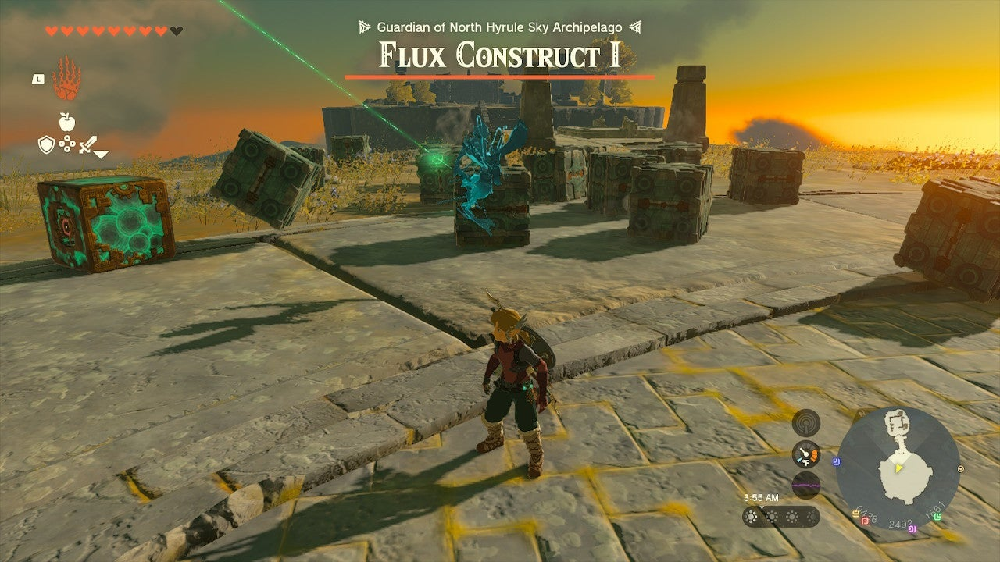{: style="width: 100%"}

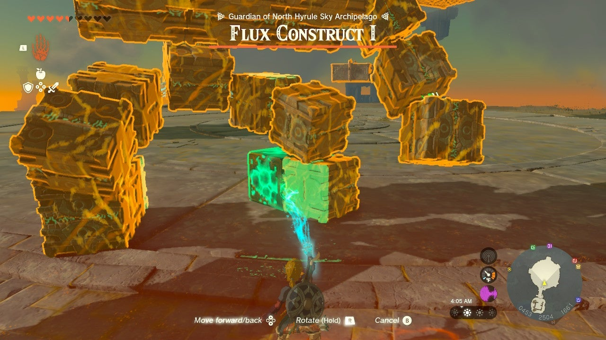{: style="width: 100%"}

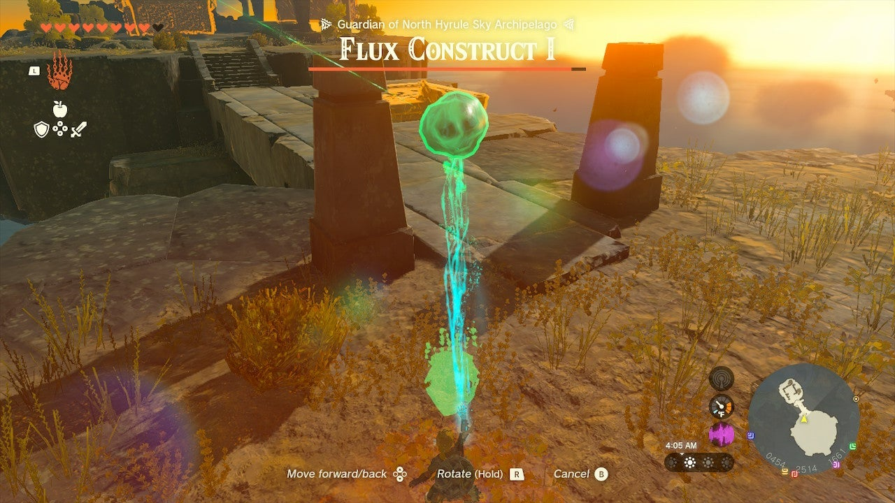{: style="width: 100%"}

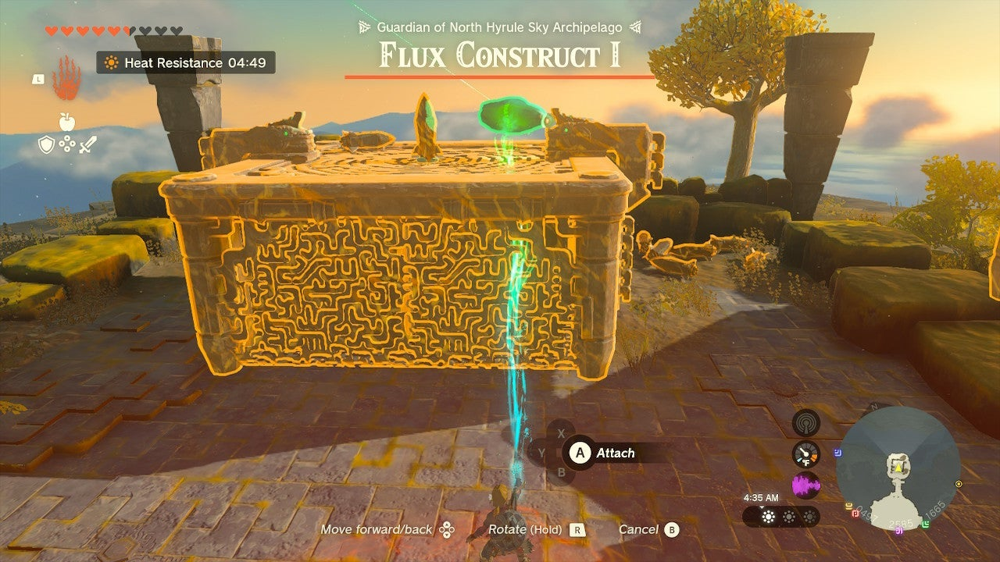{: style="width: 100%"}

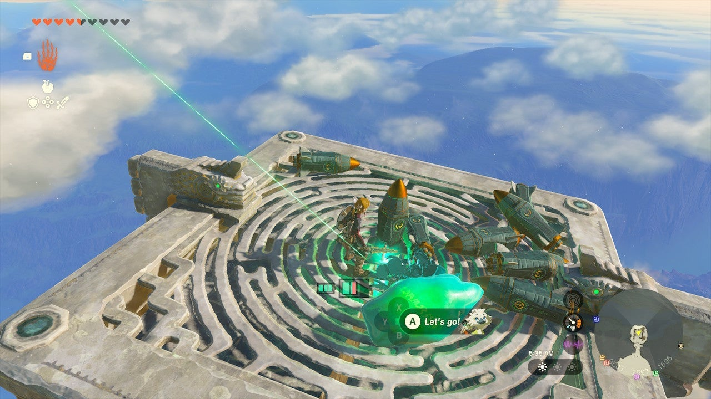{: style="width: 100%"}

Climb up with the single rocket, the crystal, and spare unattached rockets around you. Activate the first rocket to propel yourself most of the way to the island. Then, attach a spare rocket at a 45-degree angle to the platform's surface, aiming directly at the island. This should lift you up and over the island. Drop the green crystal onto the island below, disembark, and carry the crystal to the shrine pad. Step inside the shrine to claim your reward from the chest.

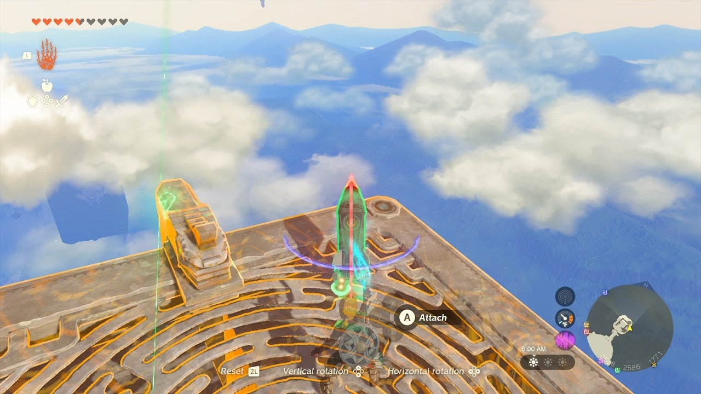{: style="width: 100%"}

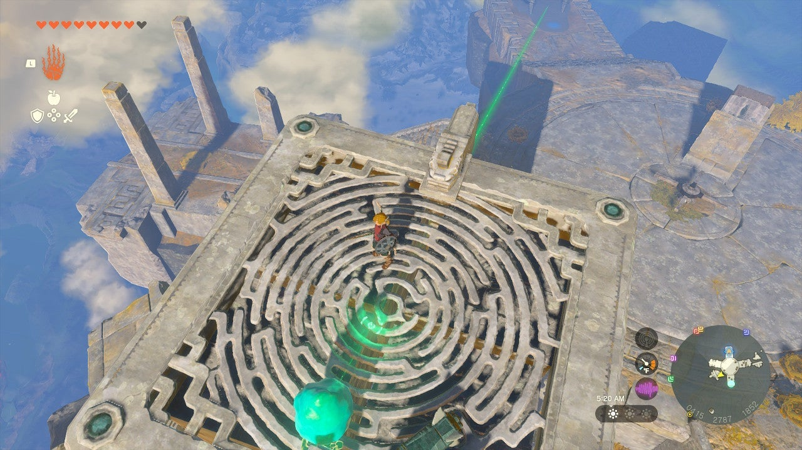{: style="width: 100%"}

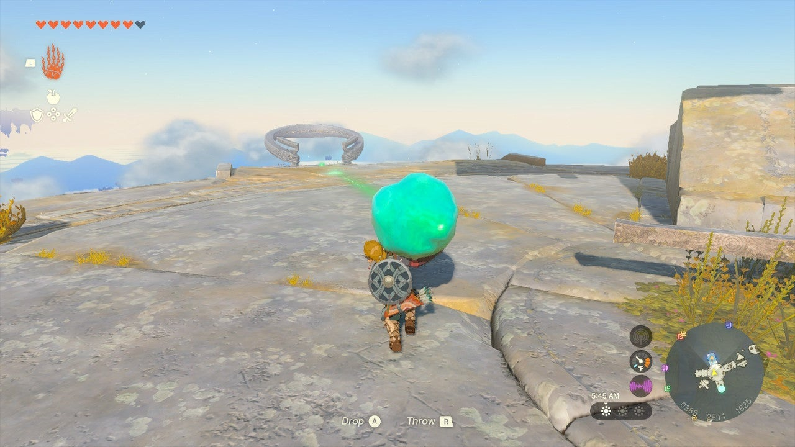{: style="width: 100%"}

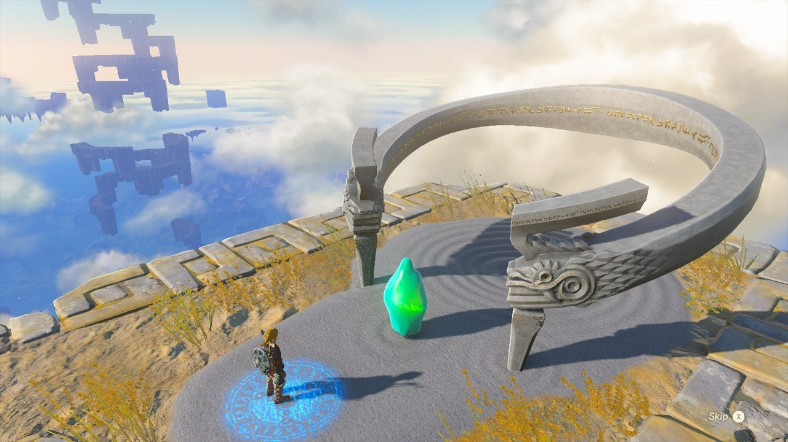{: style="width: 100%"}

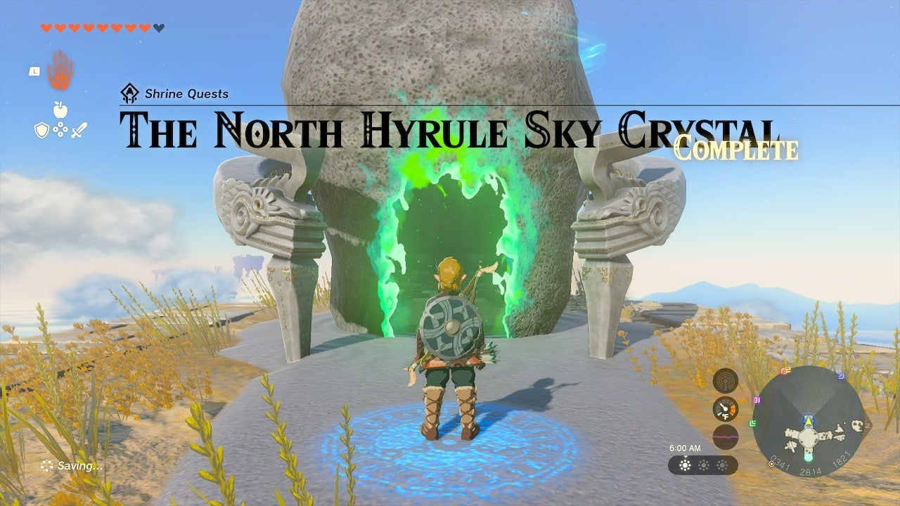{: style="width: 100%"}

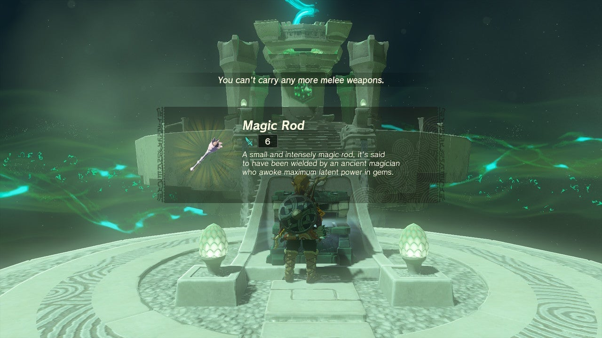{: style="width: 100%"}

## Puzzle Solutions

Getting to the shrine itself is the puzzle. The shrine offers no puzzles inside.

## Treasure Chests

Magic Rod: There is one treasure chest located right at the beginning of the Mayam Shrine.
