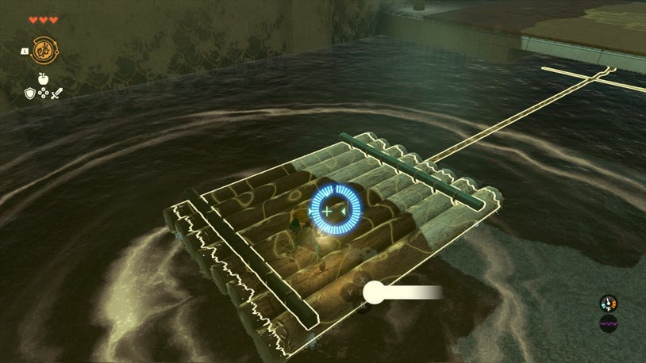
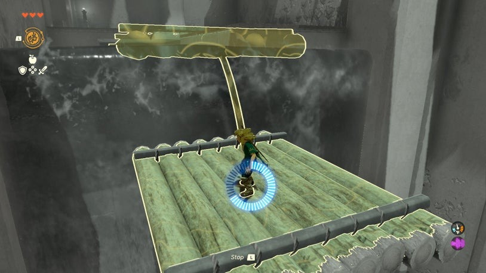
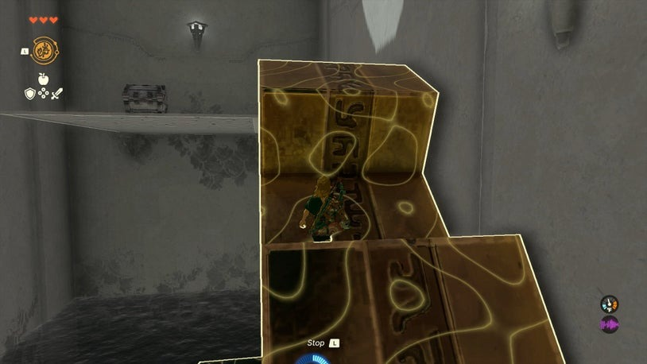
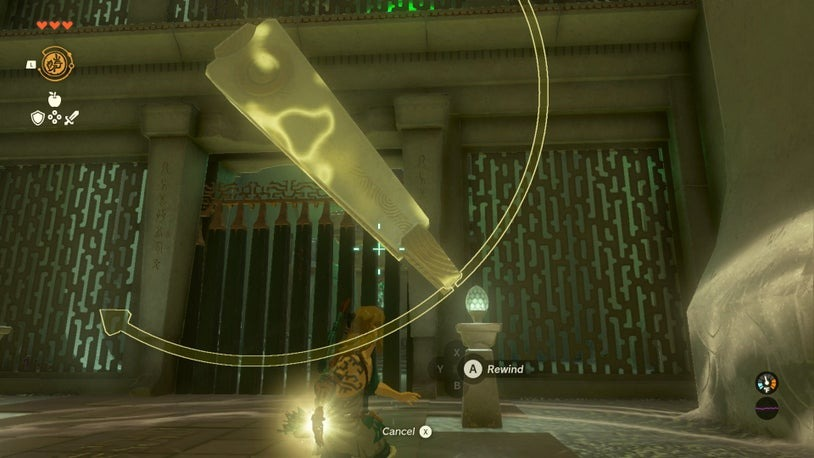

# Nachoyah Shrine

## Location and Introduction
Nachoyah Shrine is one of the shrines in TOTK and can be reached via a quest. The shrine features momentum puzzles and a final puzzle to unlock the inner shrine.

Coordinates: 0388, -1660, 2299

## Puzzle Solutions
- Momentum Puzzles: In the room with a large river, wait for a raft to drift along and use the Recall Ability to hop aboard and ride it to a stable platform. Stop Recall and wait for another raft to fall from the waterfall above. Recall it to ride it back up to the ledge above.

{: style="width=49%"}
{: style="width=49%"}

- Turning Gear Puzzle: At the top of the ledge, there is a large turning gear with a platform at the top. Use Recall on the gear to turn it into an escalator that goes up to the platform with a chest.

- Final Puzzle: The final puzzle involves two rotating clock hands that periodically align and open the door briefly. Watch the clock hands until they align, then use Recall on one of them to keep the door open while you enter the inner shrine.

## Treasure Chests
- There is a treasure chest on the platform at the top of the turning gear.
