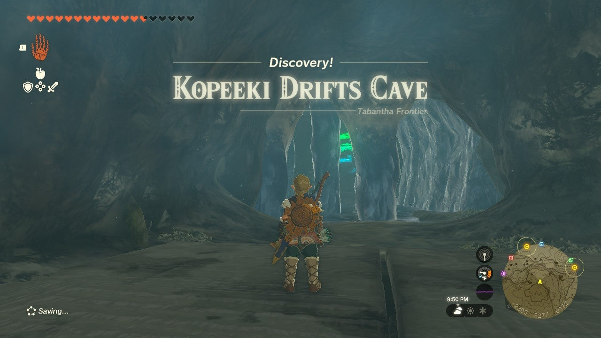

# Nouda Shrine

## Location and Introduction

{: style="width: 100%"}

Nouda Shrine, also known as Proving Grounds: Intermediate, is one of the 152 shrines in The Legend of Zelda: Tears of the Kingdom. It is located in the Tabantha Tundra Region, specifically in Kopeeki Drifts Cave. The cave is situated in the Kopeeki Drifts, a canyon west and slightly south from South Tabantha Snowfield and Snowfield Stable. You can find the entrance to the shrine on the south wall of the canyon cliffs.

{: style="width: 100%"}

{: style="width: 100%"}

Upon entering Kopeki Drifts Cave you will encounter a large cold pool of water that inflicts damage upon contact. Your objective is to create an ice bridge across the pool to reach the Nouda Shrine on the far beach. To construct the bridge, you'll need bridge parts. Explore the right side of the cave and look for a tunnel leading to a chamber with a Like-Like creature. This creature continually regurgitates ice blocks that you can utilize to build the bridge. Carefully move the ice blocks to the main chamber, avoiding the Like-Like, and assemble the bridge. You can choose to create an elaborate bridge around the stalactites or take a straight line approach by getting as close as possible to the far shore and then jumping into the water for the final stretch.

{: style="width: 100%"}

{: style="width: 100%"}

{: style="width: 100%"}

{: style="width: 100%"}

## Puzzle Solutions

To successfully navigate and overcome the challenges in Nouda Shrine, follow these steps:

{: style="width: 100%"}

{: style="width: 100%"}

1. Upon entering the main room of Nouda Shrine, grab the bow, sticks, and arrows provided to you.

{: style="width: 100%"}

2. Eliminate the Construct archer to the right by aiming for a clean headshot.

{: style="width: 100%"}

{: style="width: 100%"}

{: style="width: 100%"}

3. Make your way to the platform where the archer was positioned. Be cautious of the second archer equipped with electric arrows beneath the tower.

4. Locate the Fire Fruit on the platform and attach it to an arrow.

5. Shoot the Fire Fruit-laden arrow towards the electric archer, ensuring that you get its attention first. This will cause the archer to drop Shock Fruits with an electric effect.

6. Utilize the Shock Fruits to your advantage, as they will cause the leaves on the ground to flare up and eliminate the electric archer.

{: style="width: 100%"}

{: style="width: 100%"}

{: style="width: 100%"}

7. Engage with the remaining enemies below, utilizing any weapons and items they drop.

{: style="width: 100%"}

{: style="width: 100%"}

{: style="width: 100%"}

8. Retrieve the spiked club from one of the enemies and collect any additional Shock Fruits, arrows, or items they leave behind.

9. Prepare to face the main challenge in the shrine: a Captain Construct.

{: style="width: 100%"}

10. Use electric attacks to freeze the Captain

## Treasure Chests

- Hearty Elixir: Obtained from the chest at the exit of Nouda Shrine.

{: style="width: 100%"}

{: style="width: 100%"}
