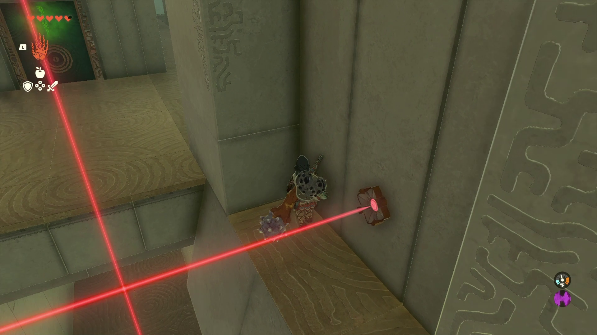
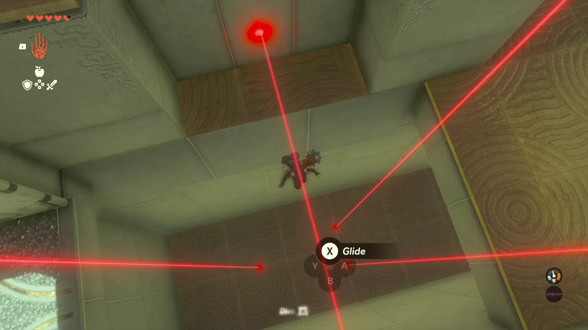
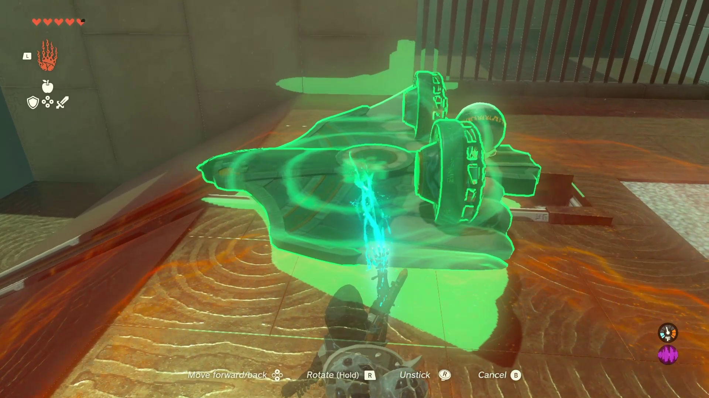

# Orochium Shrine

## Location and Introduction

Orochium Shrine, also known as Courage to Fall, is located in the Hebra Mountains Region. It is one of the 152 shrines in Tears of the Kingdom (TOTK). This guide provides information on how to locate and enter the shrine, a walkthrough for the shrine, puzzle solutions, and treasure chest locations.

Orochium Shrine is easily visible just north of Snowfield Stable in the Hebra Mountains Region.

{: style="width:100%"}

{: style="width:100%"}

## Puzzle Solutions

1. Upon entering the shrine, you will notice a hole to your left where a ball needs to be placed to complete the shrine. However, you'll have to navigate through the entire dungeon to bring the ball back to the starting point.

{: style="width:100%"}

2. Use Ultrahand to open the stone doors in the shrine. Proceed inside and you'll encounter a laser grid that triggers a trapdoor if touched. Avoid the lasers for now and go around the corner to the left to defeat a single enemy.

{: style="width:100%"}

3. After defeating the enemy, use Ascend to reach the next level. Go up the ladder, turn right before dropping down, and crouch by pressing in the Left Thumbstick. Take note of the enemy's position, then perform a falling attack to defeat it.

{: style="width:100%"}

{: style="width:100%"}

4. Proceed to the right of the double doors and defeat another enemy. Then, open the double doors with Ultrahand. You'll face another laser grid, but this one is avoidable. Defeat the two descending enemies and continue forward to find yourself in a hallway with another laser grid.

{: style="width:100%"}

5. Navigate through the laser hallway, sticking to the sides and avoiding the lasers. Once the horizontal lasers rise enough to run under them, proceed to the end of the hallway. Ascend on the other side to find a chest containing the Small Key.

{: style="width:100%"}

{: style="width:100%"}

{: style="width:100%"}

6. Cross the laser hallway again and unlock the green door with the Small Key. Retrieve the ball inside the room. Carry the ball to the other side of the green door room and step onto one of the moving blue platforms to ascend to a platform with a hole for the ball. Place the ball in the hole.

{: style="width:100%"}

{: style="width:100%"}

{: style="width:100%"}

7. Retrieve the glider from the other side of the lowered gate. Use Ultrahand to grab the ball once more and place the glider on the rails. Hop on the glider and strike the fans to carry both Link and the ball back to the shrine entrance.

{: style="width:100%"}

{: style="width:100%"}

8. Finally, place the ball in the hole near the entrance to open the final gate.

## Treasure Chests

Arrows (5x): This chest is in the room with the green door.
