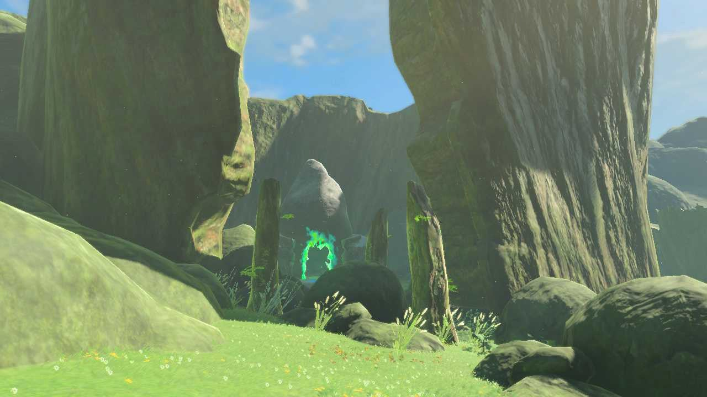
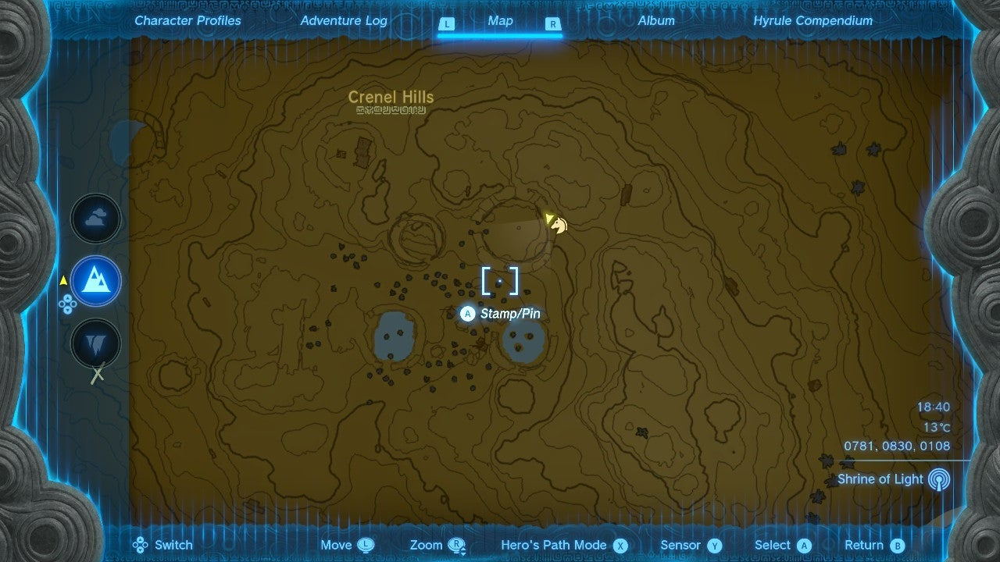
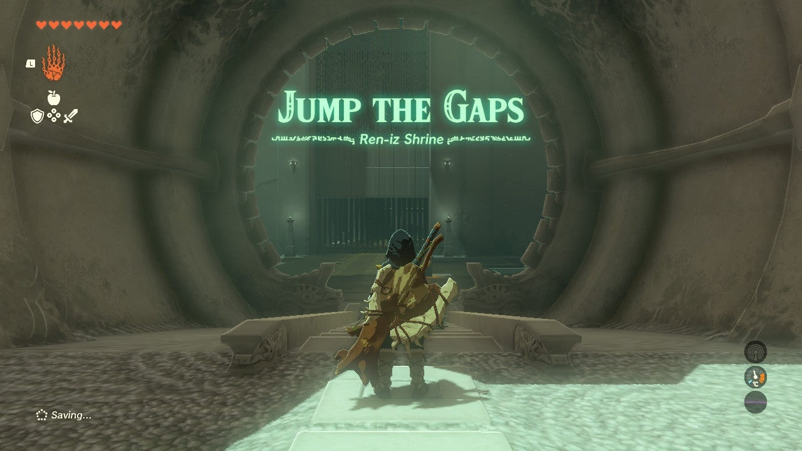
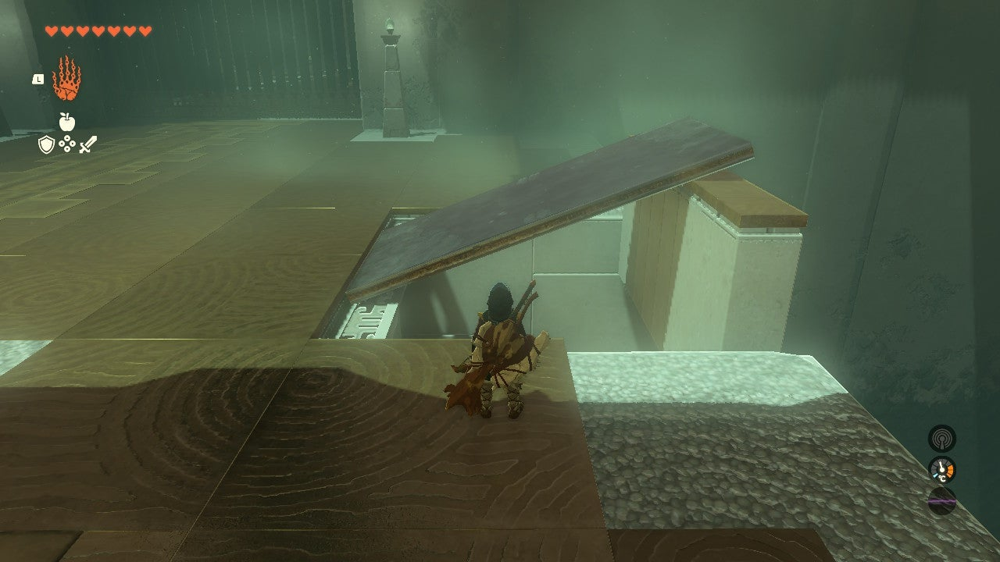
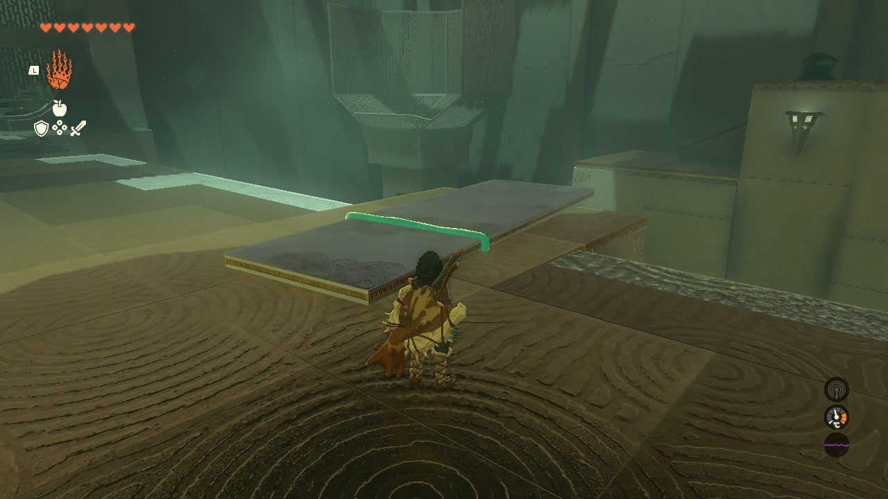
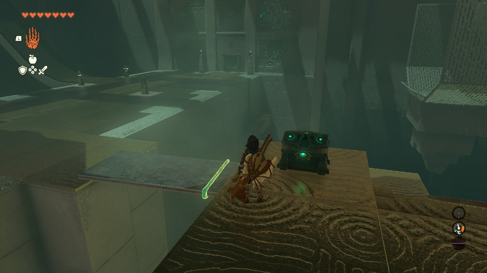
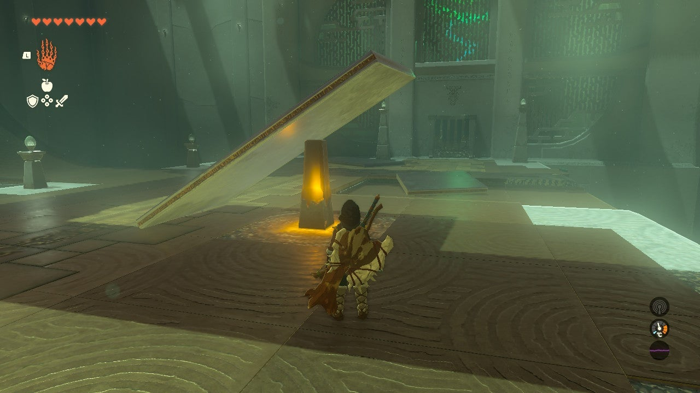
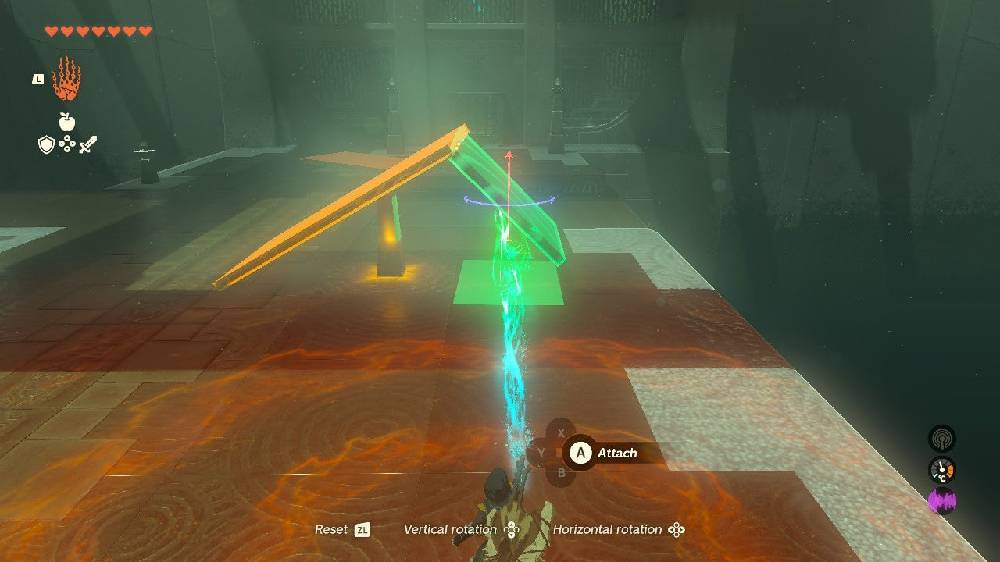
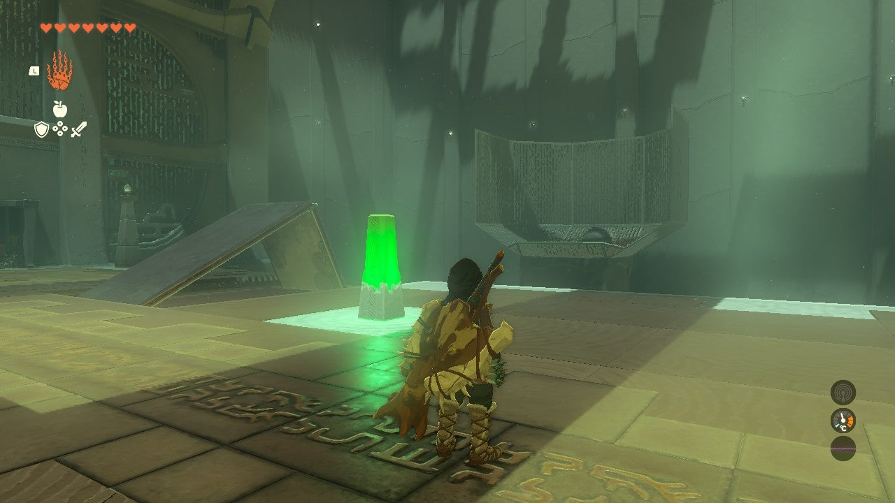

# Ren-iz Shrine

## Location and Introduction

Ren-iz Shrine, also known as "Jump the Gaps," is a shrine located within the Crenel Hills. You can find this shrine nestled in the remains of a massive carved-out tree at higher points of the hills. 

{: style="width: 100%"}
{: style="width: 100%"}

## Puzzle Solutions

{: style="width: 100%"}

1. In the first room, there is a large downsloping ramp on the left side. Hit the glowing pillar to release a ball that needs to jump across the gap on the right and land in the basket. Use Ultrahand to prop up a metal plate just past the glowing activation pillar on top of the raised wall, creating a ramp. Make sure the metal plate is positioned securely on the stone wall, not on the stone floor. Test the ramp by letting the ball roll across it and into the basket.

{: style="width: 100%"}

2. Before proceeding to the second room, grab the treasure. After entering the next room, look to the right in the shadows. You'll see a lone platform with a ramp leading to a treasure. Go back to the first room and use Ultrahand to grab the metal plate. Attach a shorter square metal plate to it, creating a bridge to reach the treasure chest. Open the chest to obtain a Zonaite Shield.

{: style="width: 100%"}
{: style="width: 100%"}

3. In the second room, grab one of the long metal plates and use the glowing pillar as a stand for it, propping it up. Be careful not to stand in the ball's path when activating the pillar. Use Ultrahand on a short metal plate and rotate it to create an angled platform. Align the edges of the longer and shorter platforms to form a ramp. Place the ramp in the designated spot, ensuring it is flush with the higher floor to allow the ball to roll smoothly. Release the ball and complete the shrine.

{: style="width: 100%"}
{: style="width: 100%"}
{: style="width: 100%"}

## Treasure Chests

- Zonaite Shield: In the first room, there is a treasure chest located on a lone platform with a ramp. Use a bridge made of metal plates to reach the platform and open the chest.
