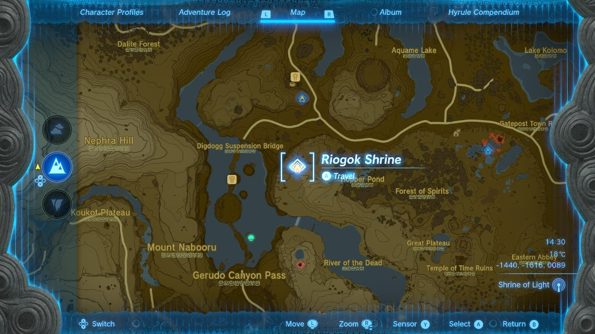
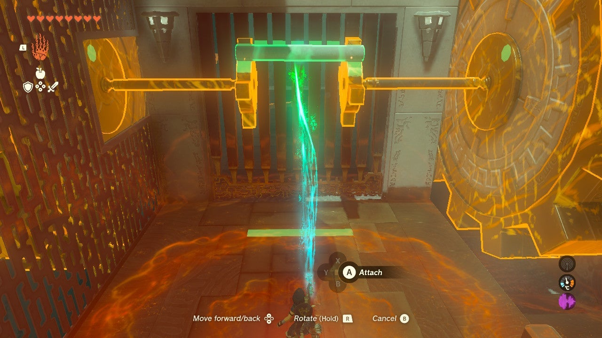
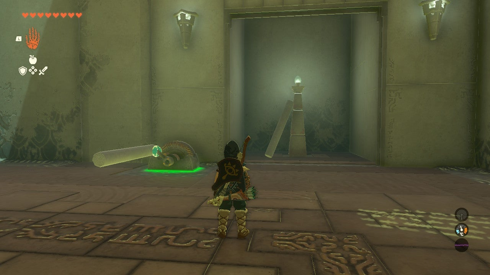
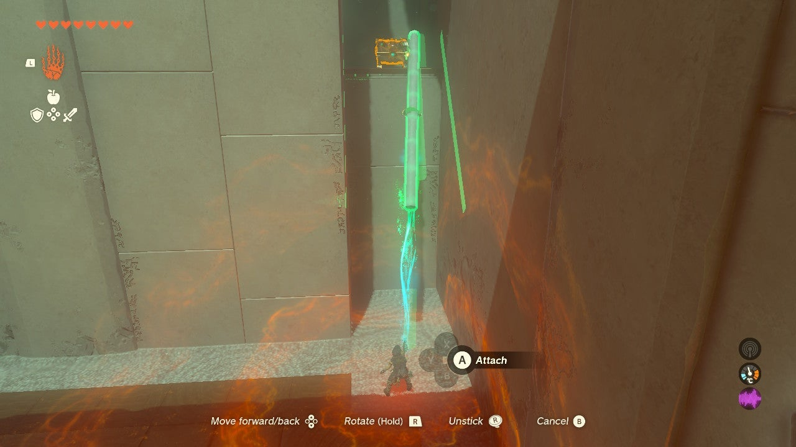
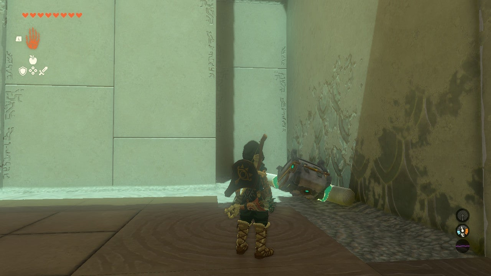
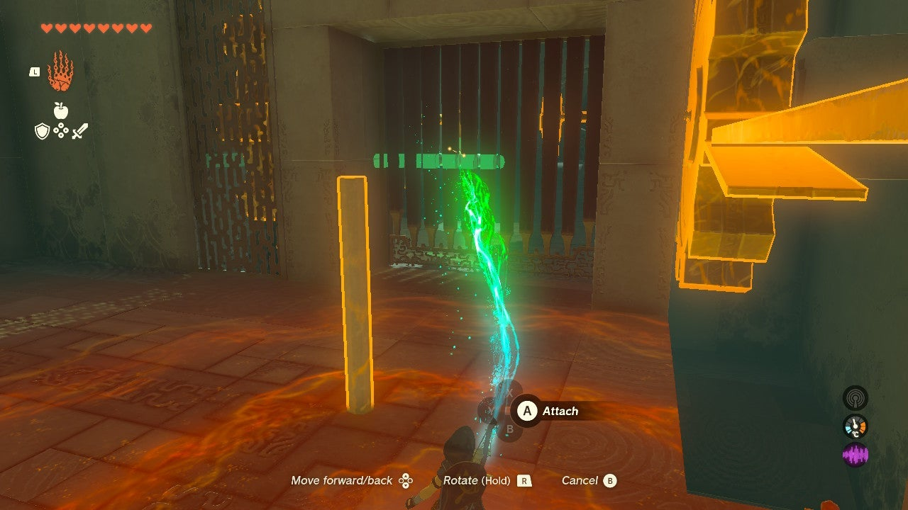
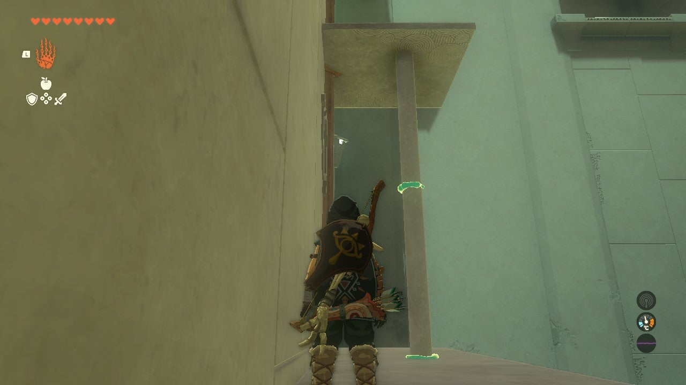
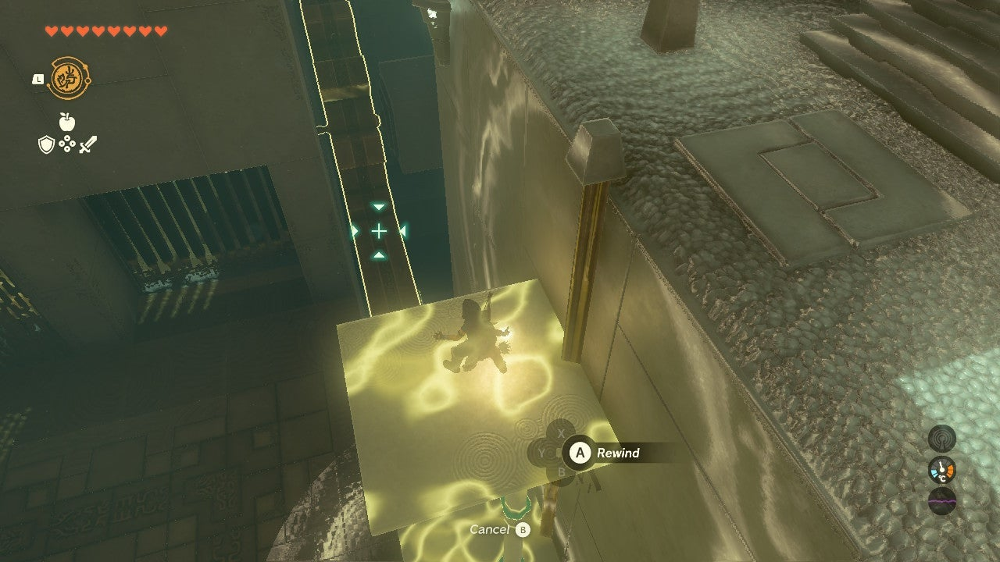
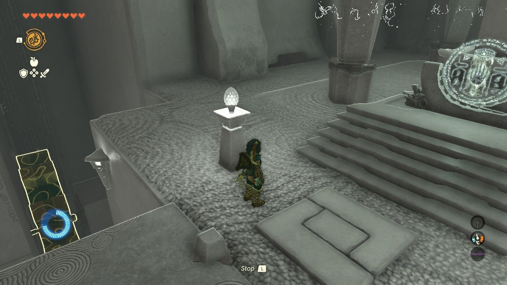

# Riogok Shrine

## Location and Introduction

Riogok Shrine, also known as the Shrine of Force Transfer, is located in the Central Hyrule Region. The shrine is situated south of the Outskirt Stable, just west of Hopper Pond and east of the Mini Stable.

{: style="width: 100%"}

## Puzzle Solutions

1. In the introductory puzzle, you'll need to use Ultrahand to fuse the pole on the right side of the room to the two suspended cogs in front of the gate. By fusing the pole to one of the cogs, the other giant wheel will turn and open the gate.

{: style="width: 100%"}

2. In the next room, there are a few movable objects. Start by obtaining the second pole. Attach the new pole to the lever and use Ultrahand to move the lever to the left. This will open the gate.

{: style="width: 100%"}

3. To the left of the lever, there is a cove with a high platform that holds the shrine's treasure. Fuse the two poles together to create a long pole. Use Ultrahand to raise the pole up to the treasure chest and attach it. The chest may fall forward upon fusing, but if not, you can drag it down. Inside, you'll find a Construct Bow.

{: style="width: 100%"}
{: style="width: 100%"}

4. Disconnect the two poles to prepare for the exit. Getting out can be tricky, as you'll need to retrieve the first pole used to open the gate on your side of the wall. Follow these steps carefully to ensure a successful exit.

{: style="width: 100%"}
{: style="width: 100%"}
{: style="width: 100%"}
{: style="width: 100%"}

## Treasure Chests

- Construct Bow: Found on top of a high platform in a cove to the left of the lever in the second room. Use Ultrahand and the fused poles to reach the treasure chest.
