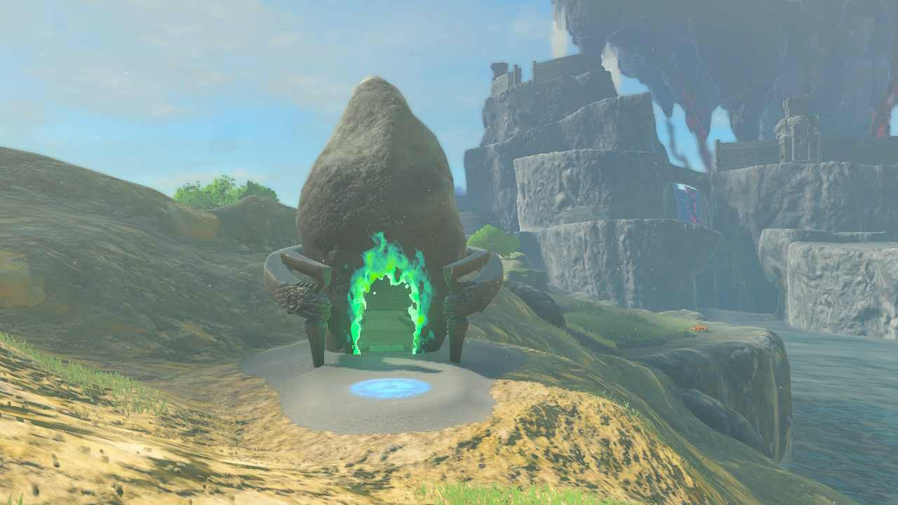
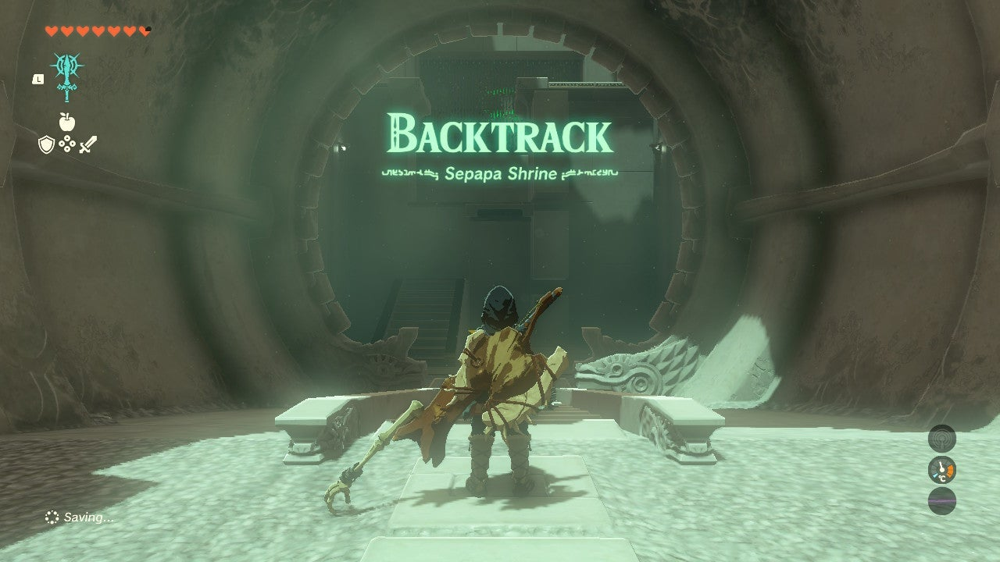
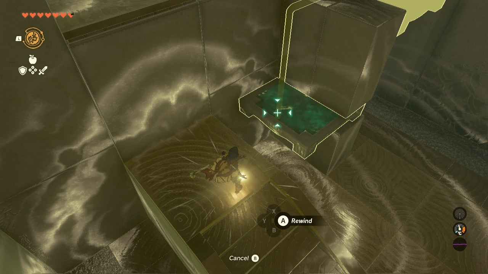
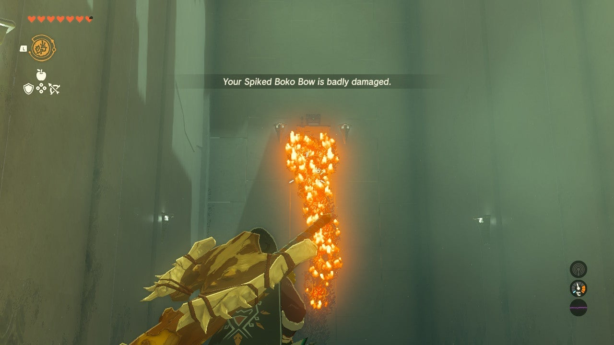
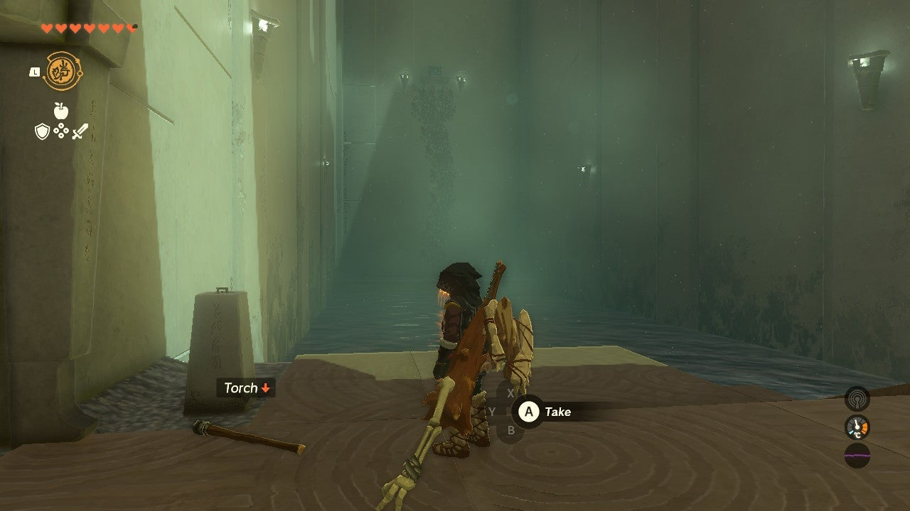
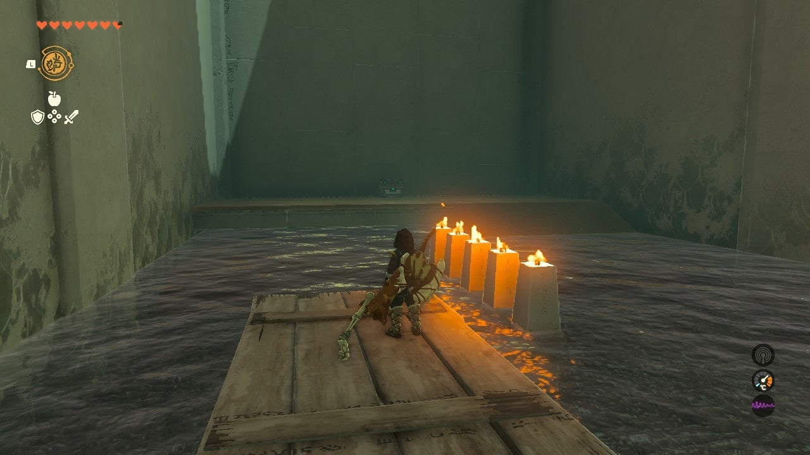
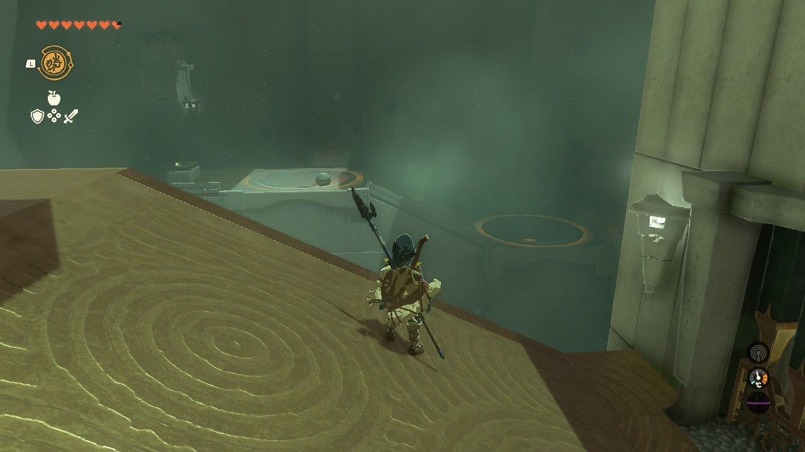

# Sepapa Shrine

## Location and Introduction

Sepapa Shrine, also known as "Backtrack," is located in the Central Hyrule Region, specifically in Hyrule Field to the east of Hyrule Castle. It offers a nice river view and is hidden by a small hill. To locate and enter the shrine, look for the swirling green lights emitted by shrines at night. Be prepared to use the Recall ability, as it will be needed immediately in the shrine.

{: style="width: 100%"}

## Puzzle Solutions

{: style="width: 100%"}

1. In the first room, climb the stairs and wait for the moving platform to pass under the barrier. Use Recall and hop onto the platform to reach the next room.

{: style="width: 100%"}

2. In the first large room after the opening staircase, there is a treasure chest across the water on a platform with vines going up the wall. Use a fire arrow or a torch to set the vines on fire and reach the wooden platform where the chest is located. Open the chest to obtain a Strong Construct Bow.

{: style="width: 100%"}

3. To proceed with the puzzle, light the two pillars in the room. You can use Fire Fruit or a weapon that can catch fire. If you don't have either, use the torch on the ground before the door. Wait for the raft to appear to the right of the door and hop on. Use Recall on the raft when you are next to the fire, and then use the torch to light it. Note that if you use Recall on the raft after lighting the torch, the torch will go out.

{: style="width: 100%"}
{: style="width: 100%"}

4. In the third room, you will need to use Recall on a ball from a distance. Walk along the wall and pass two spots where a ball can be dropped to activate a mechanism. When ready, use Recall on the ball to roll it into the port and open the second gate. This will lead you to the Light of Blessing and the shrine exit.

{: style="width: 100%"}

## Treasure Chests

- Strong Construct Bow: In the first large room, there is a treasure chest located on a platform with vines going up the wall. Use a fire arrow or a torch to reach the chest.
