# Serutabomac Shrine

## Location and Introduction

Serutabomac Shrine, also known as "The Way Up," is a shrine located on the northeast side of the Hyrule Castle island in The Legend of Zelda: Tears of the Kingdom. To reach this shrine, you can use the paraglider to glide over from a high point above the castle or by completing the challenge in Rito Village to make gliding easier. Once you're outside the castle, climb to gain some height and glide over to the northeastern part of the island. The shrine can be found on the B1 level of the dungeon.

{: style="width: 100%"}

## Puzzle Solutions

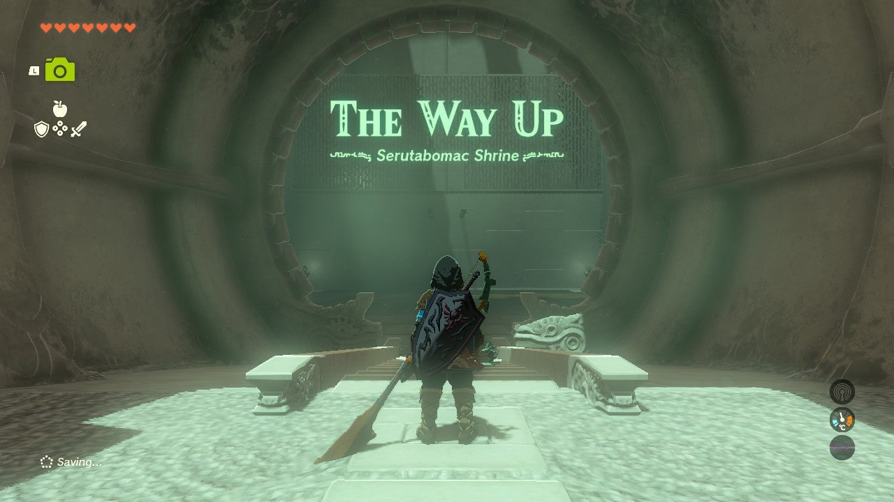{: style="width: 100%"}

1. In the first room, use the Ultrahand to place a metal plate in front of the high door. Stand under it and use Ascend to reach the next room.

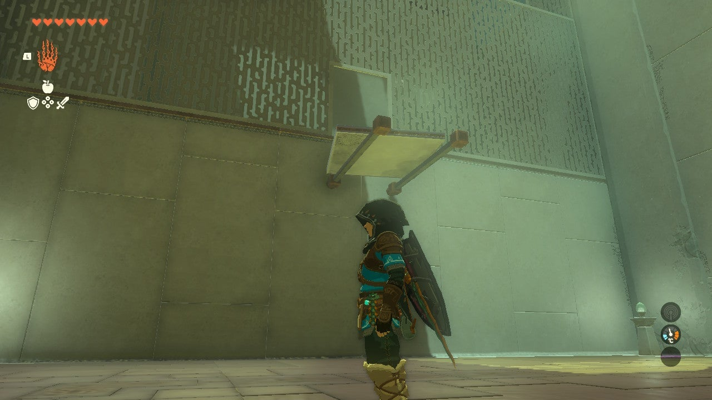{: style="width: 100%"}
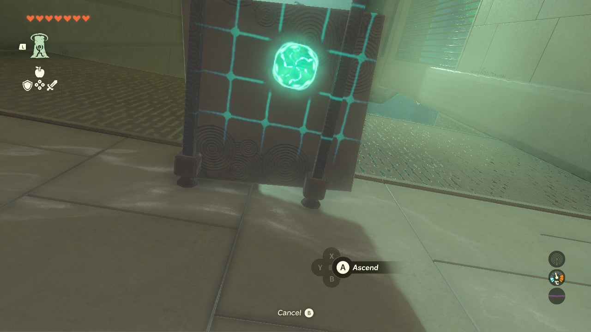{: style="width: 100%"}

2. In the second room, pick up a square metal plate and position it vertically. Then grab the longer plate. Use Ascend to exit the room.

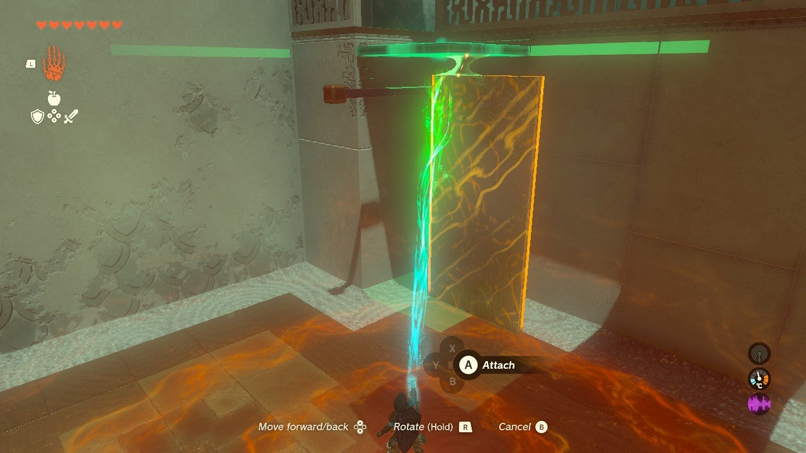{: style="width: 100%"}
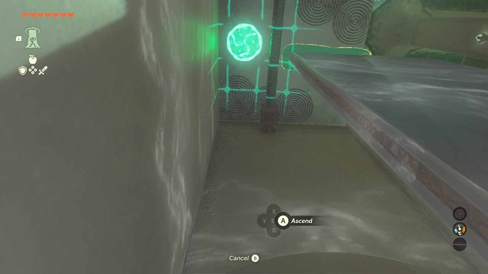{: style="width: 100%"}

3. In the third room, connect all the metal plates to form one long piece. Lift the plate assembly against the wall, pushing it onto the platform. Use Ascend to reach the platform and claim the Magic Rod from the treasure chest.

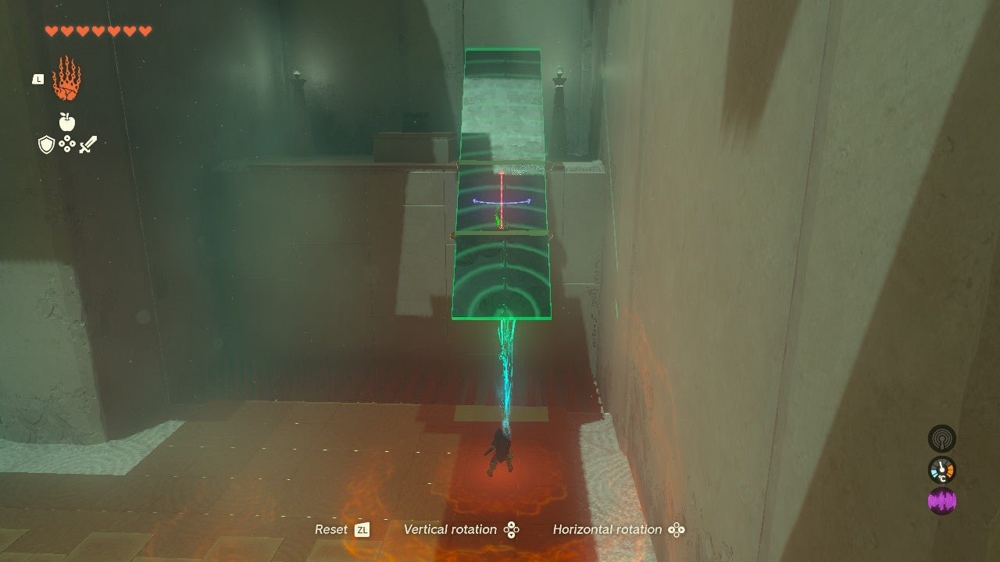{: style="width: 100%"}
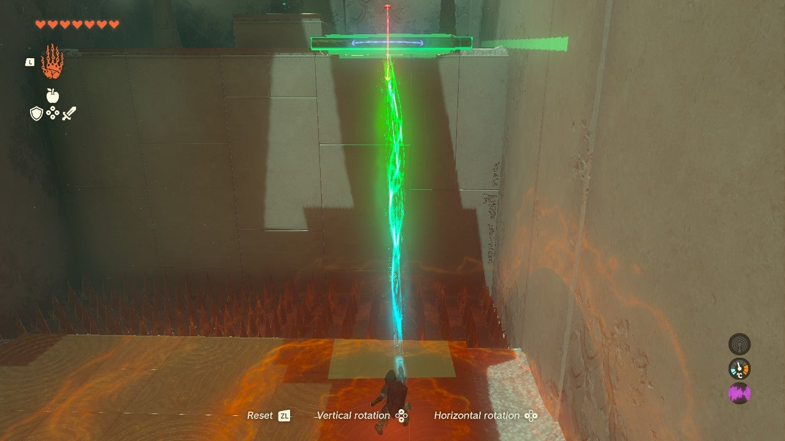{: style="width: 100%"}
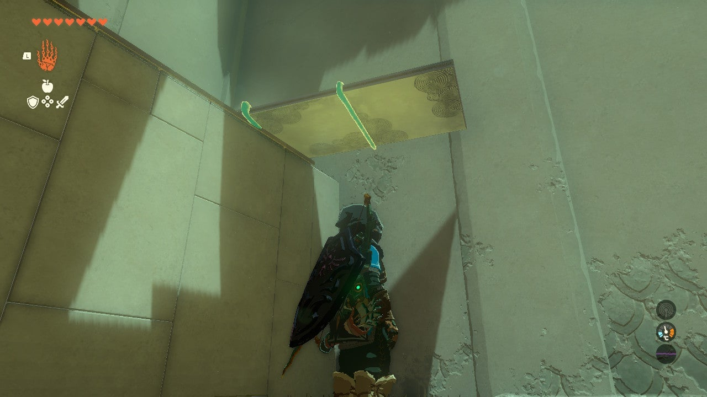{: style="width: 100%"}
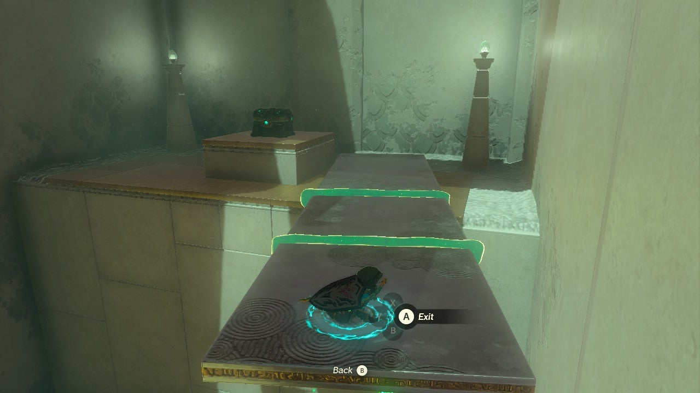{: style="width: 100%"}

4. Throw the metal platform down to the third room using the Ultrahand and glide down to meet it.

5. In the final room, construct a structure using the long metal plate as the base. Attach two square metal plates vertically to each end and a third square plate horizontally on top to create a small roof.

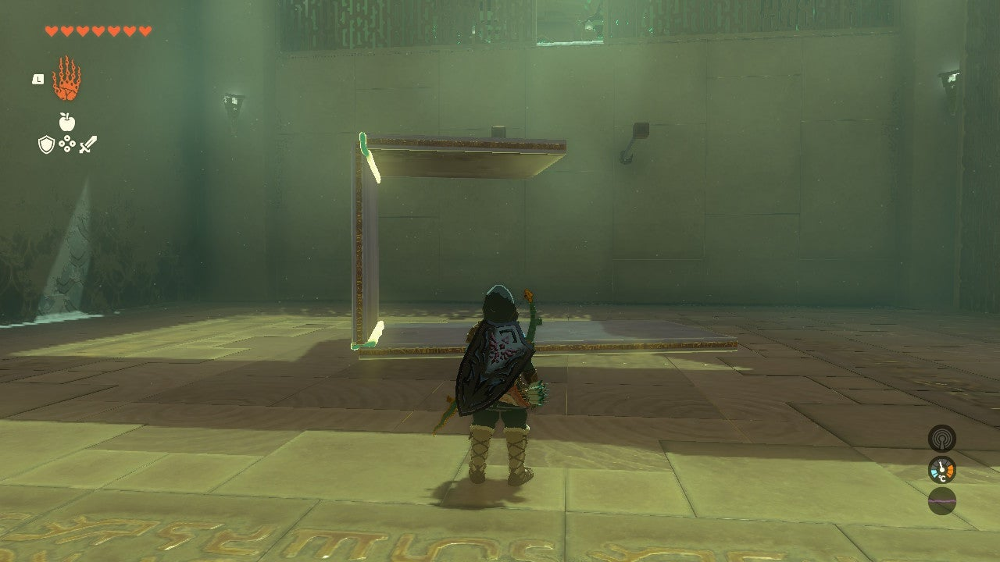{: style="width: 100%"}

6. Lift the structure with the Ultrahand and place it on the beams below the door. Make sure the top square metal plate aligns with the door.

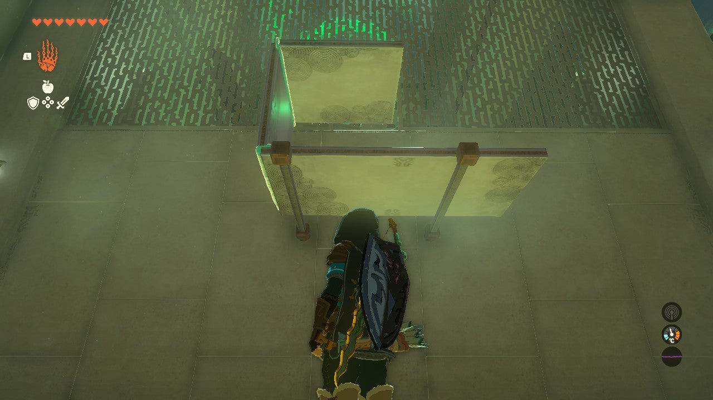{: style="width: 100%"}

7. Use Ascend twice to ascend through the structure and reach the exit.

## Treasure Chests

- Magic Rod: In the third room, there is a treasure chest located on the far wall across from the door. Construct the metal plate structure to reach it and claim the reward.
