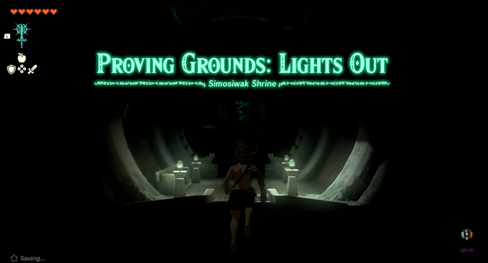

# Simosiwak Shrine

## Location and Introduction

{: style="width: 100%"}

Simosiwak Shrine, also known as Proving Ground: Lights Out, is situated atop an island in the sky above the Great Hyrule Forest, specifically in the North Hyrule Sky Archipelago. This shrine guide provides information on how to locate and enter the shrine, a walkthrough for the shrine itself, puzzle solutions, and details about treasure chest locations.

To unlock the Simosiwak Shrine, you must first reach Bravery Island in the Great Hyrule Forest Sky. Speak with a construct on Bravery Island who will challenge you to dive through a series of rings while falling through the sky. Successfully pass through all the rings to reveal the Simosiwak Shrine. Its coordinates are `0163,1972,0759`.

{: style="width: 100%"}

If you have previously unlocked the Mayam Shrine, you can use it to easily reach Bravery Island. Simply spin the launcher until it faces southwest towards Bravery Island. It can be identified by its location directly below a group of semi-circular islands.

{: style="width: 100%"}

The Simosiwak Shrine is a proving grounds trial that removes all your items, requiring you to utilize only what you can find within the shrine. Once inside, the area is dark, so you must make use of the two light shields provided to navigate. Prepare to fight your way through a small room containing three aggressive constructs.

## Puzzle Solutions

1. Upon entering the shrine, proceed straight ahead until you reach a corner where a Flame emitter is located. Attach it to one of your weapons or carry it around to enhance your range for attacking constructs. This will be more effective than the other weapons found within the shrine. Take out any constructs that may be chasing you before continuing.

{: style="width: 100%"}

2. Head up the nearby staircase to reach an area with rubies on the ground and a construct wielding a flame rod. Defeat the construct and collect the rubies.

{: style="width: 100%"}

{: style="width: 100%"}

3. Return back down the staircase to the corner where you found the Flame emitter. Look for a patrolling construct with a light shield and a flame emitter. Take it down and replace any destroyed light shields with the construct's shield. There should also be a spare flame emitter to attach to your stick.

{: style="width: 100%"}

{: style="width: 100%"}

4. If there are still constructs remaining, return to the entrance and turn right. You will find an L-shaped wall with a long stick and shield in the corner. Use them if needed. There will be one more construct patrolling on the opposite side of the wall. Defeat it to drain the remaining life bar and unlock the door.

5. Open the chest inside the unlocked door to obtain a Bright Elixir and reach the altar to receive your Light of Blessing.

{: style="width: 100%"}

{: style="width: 100%"}

## Treasure Chests

Bright Elixir: This treasure chest can be found behind the unlocked door.
