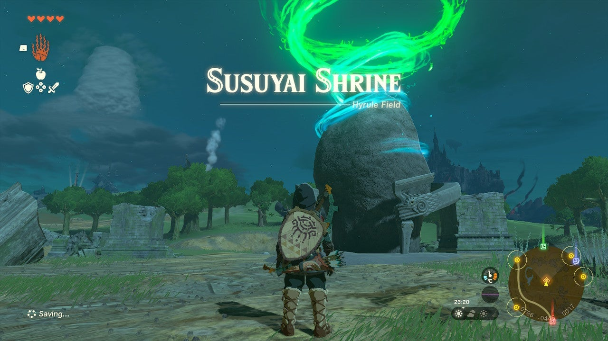

# Susuyai Shrine

## Location and Introduction

Susuyai Shrine can be found on the ground in plain sight in the Passeri Greenbelt, southwest of Lookout Landing. This shrine features a unique challenge involving a "spinning device" and requires careful navigation.

{: style="width=100%"}
{: style="width=100%"}

## Puzzle Solutions

To progress through the shrine, follow these steps:

1. Cross the highway carefully, being cautious of the three lanes of high-speed traffic that can cause damage.
2. Use your Ultrahand to grab the car in the middle lane. This car contains a treasure chest. Position the car against the wall and climb atop it to open the chest and obtain Arrow x5.
3. Your task is to get a car over the next rotating floor. Grab a moving car from the highway and drop it against a wall. Disable the car's tires by whacking one with your weapon or fuse the car with another object on the ground to stop it.
4. Place the stopped car on the rotating floor. Stand in front of the car and activate a single wheel to turn on all wheels. Hop aboard the car and ride it up and over the rotating floor.
5. In the next area, you'll encounter a closed gate and a spinning wooden device. The device opens the door when pressure is applied. Place a car in front of it, activate the car, and let it run into the device to open the door.
6. Proceed to the next area, which features a long track, two wheels, and a hanging platform. The platform is already free-hanging on the track and can be easily moved. Attach one of the wheels to the front of the hanging device, ensuring it touches the track.
7. Hop on the platform and aim an arrow upwards at the wheel to turn it on and set the platform in motion. Use the arrows obtained from the previous chest to achieve this.
8. Finally, exit the shrine and continue your adventure.

{: style="width=100%"}
{: style="width=100%"}
{: style="width=100%"}
{: style="width=100%"}
{: style="width=100%"}

## Treasure Chests

- Arrow x5: Found in a car on the highway in the middle lane. Position the car against the wall and climb atop it to open the chest.
