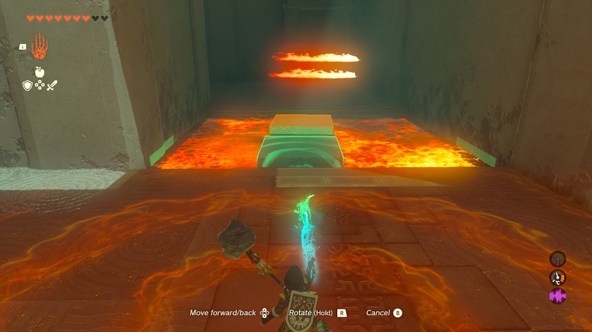
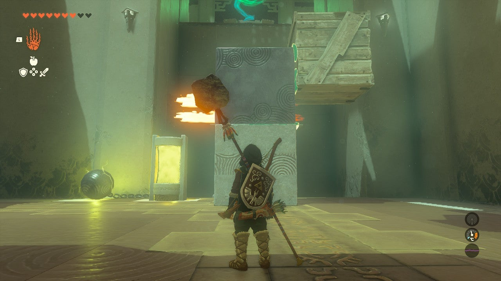

# Tadarok Shrine

## Location and Introduction

Tadarok Shrine is a shrine located in the Great Plateau of the Central Hyrule Region. To find this shrine, you must explore a cave beneath Mount Hylia. The entrance is near the waterfall at the beginning of the River of the Dead. If you approach from the Temple of Time Ruins, you'll notice a Blupee to the west of the waterfall. Cross over by climbing up the east side of the waterfall and gliding across. Follow the Blupee until it disappears, then continue along the path behind the waterfall. You will receive a notification indicating that you have discovered the shrine. Look up to find a Bubbulfrog hiding in the stalactites, which you can shoot down with an arrow. Proceed into the cave and defeat the Like Like blocking the path to reach the entrance of the shrine.

{: style="width: 100%"}

## Puzzle Solutions

1. Upon entering Tadarok Shrine, you will encounter a pool of water with two electrical devices that pump electricity into it, making it dangerous to cross. 

{: style="width: 100%"}
{: style="width: 100%"}
{: style="width: 100%"}

2. Use the Ultrahand from your inventory to lift the spheres out of the pool and place them on the far surface, ensuring the water becomes safe to cross. Before crossing the water, take the stone cube from the entrance room with you. In the next chamber to your left, you will find a treasure chest. Protect the ice cube from the flames by placing the stone cube in front of them. Ensure the ice cube remains full-sized, replacing it if it shrinks. Use the Ultrahand to move the ice cube to the treasure chest and climb on it to claim your reward.

{: style="width: 100%"}
{: style="width: 100%"}
{: style="width: 100%"}
{: style="width: 100%"}

3. Next, you will come across another electrified pool of water and a lava pool. Remove the sphere from the electrified pool to make it safe, and also take the second stone cube from this pool. 

4. Use the Ultrahand to move both stone cubes, one from the pool and one from the entrance room, into the lava pool, creating a path across. In this area, you can save the wooden crate from burning by immediately dousing it in the nearby pool. Move this cube across the lava and into the central room.

{: style="width: 100%"}
{: style="width: 100%"}

5. To reach the high ledge with the exit, you will need to solve a challenging puzzle. Attach the two stone cubes vertically using the Ultrahand. 

{: style="width: 100%"}

6. Then, attach the wooden cube to the top of the stack, positioning it halfway up and over the side to create a step. 

7. Lift the bottom of the stack with the Ultrahand onto the platform with the fire, taking care not to expose the wood. The two stone cubes will remain safe. 

8. Use the stone cubes to block the flames, and the wooden cube will provide enough height to reach the platform above, positioned about halfway down. 

{: style="width: 100%"}
{: style="width: 100%"}

9. To pass through the stone cubes, place the ice cube underneath them and activate Ascend to go through the two stone cubes, emerge on top, and then hop onto the wooden cube to exit the shrine.

{: style="width: 100%"}
{: style="width: 100%"}

## Treasure Chests

- Mighty Zonaite Shield: Located in the chamber to the left after crossing the safe water. Use the ice cube to reach it.
