# Tajikats Shrine

## Location and Introduction

Locate the shrine on the surface of the bank of the Hylia River in Central Hyrule, south of Lookout Landing. It is near the Riverside Stable, serving as the warp point for the stable.

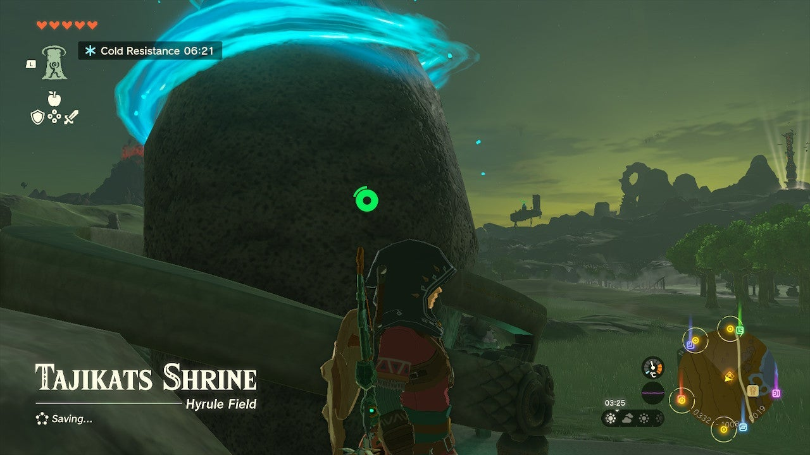{: style="width: 100%"}
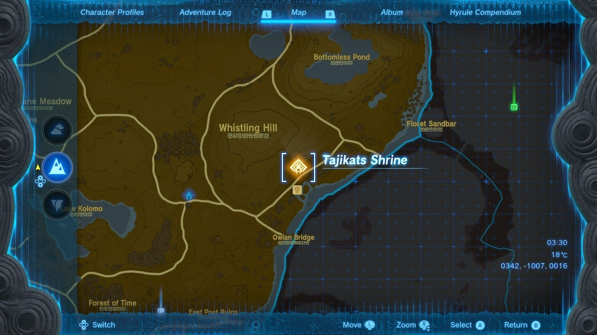{: style="width: 100%"}

## Puzzle Solutions

1. In the first room, there is a log and a ledge. Use the Ultrahand ability to pick up the log. Hold the log aloft and rotate it so that the green shadow is on the upper part of the ledge. Drop the log to create a slanted walkway upward.

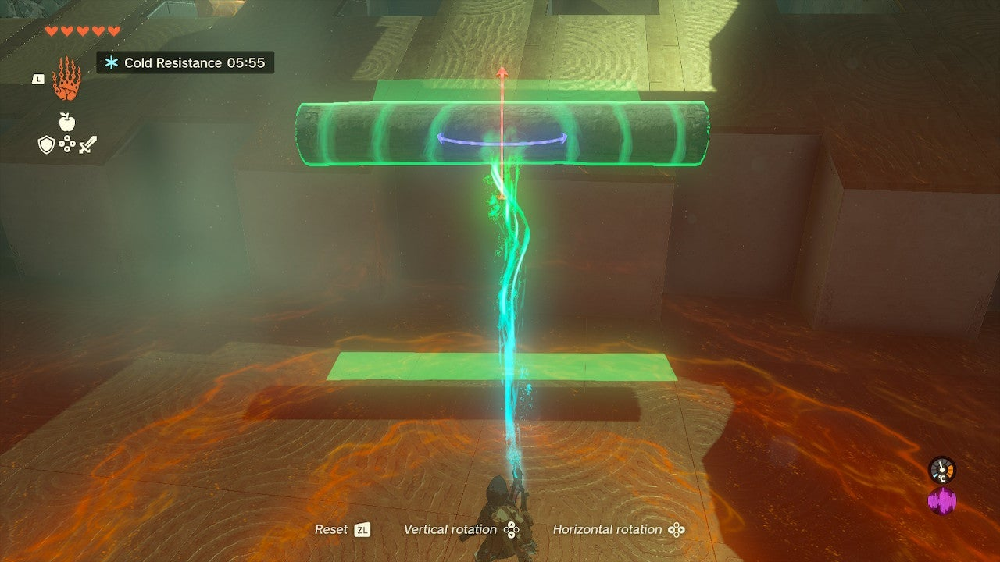{: style="width: 100%"}
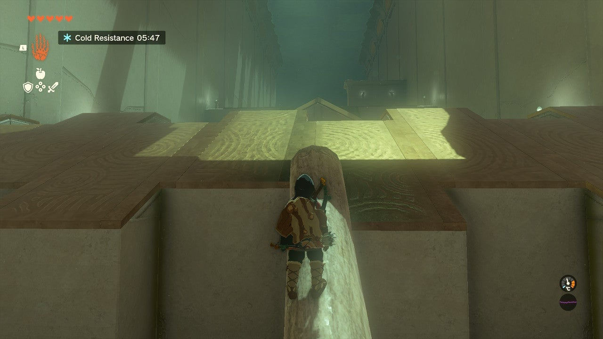{: style="width: 100%"}

2. In the second room, there is a large pool, two logs, and a pyramid-like structure with a gap. Use Ultrahand to bind the two logs together and create a bridge at the point of the structure. Use the green shadows to line up the logs correctly.

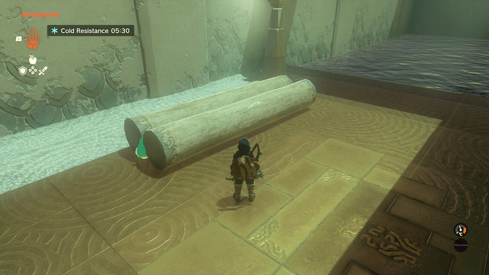{: style="width: 100%"}
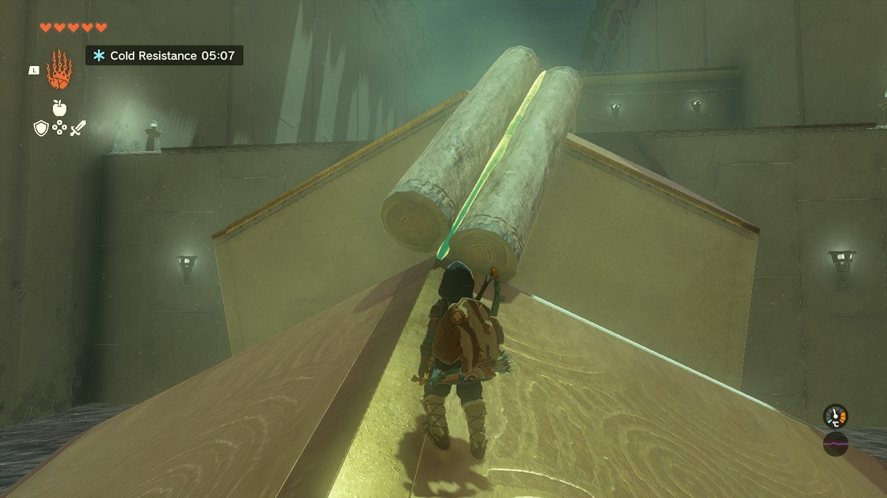{: style="width: 100%"}

3. The next area features a watery gap and a ledge with a strong current pushing you back. Use the previous two logs to create three pairs of logs and attach them end-to-end. This will give you a three-log-long bridge. Drop it over the gap and run across.

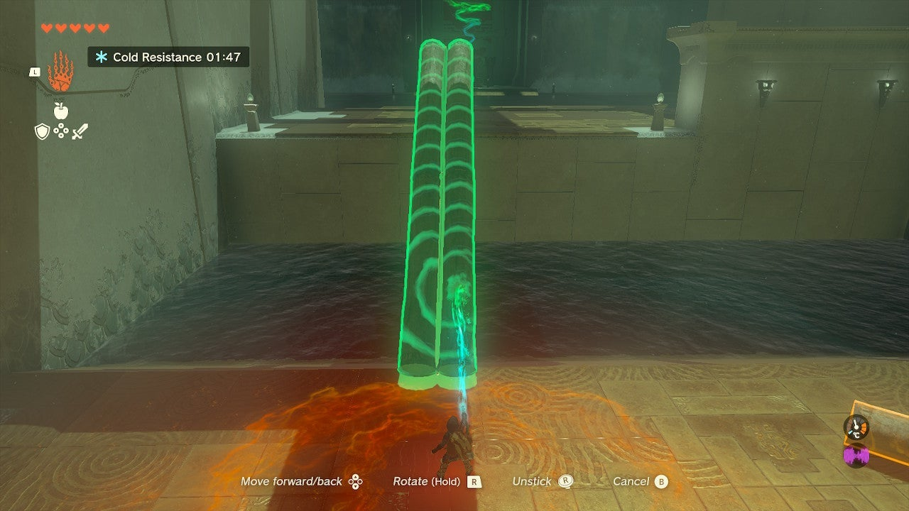{: style="width: 100%"}
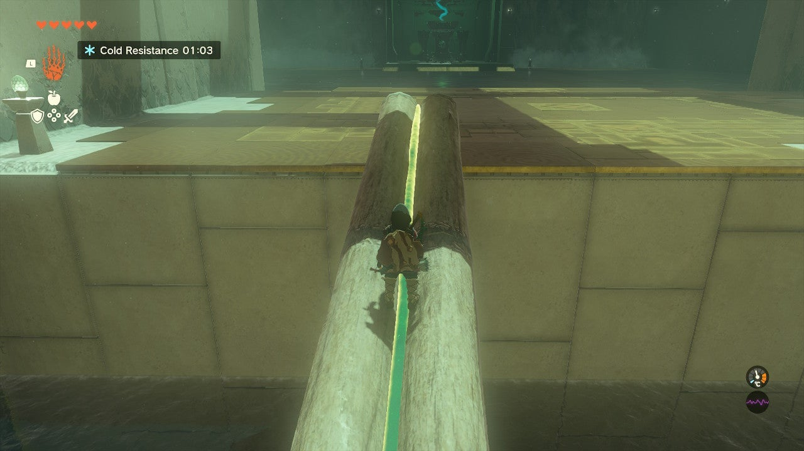{: style="width: 100%"}

4. The exit and a treasure chest are located across a vast pool. To reach them, create a boat out of fans and logs. Connect three logs side-by-side to form a raft. Mount two fans on either side of the rear of the boat. Aim the fans so that the blades push away from the front of the boat. Head towards the left wall to find a boat landing ramp against the wall. Use the boat to reach the small island where a treasure chest is located.

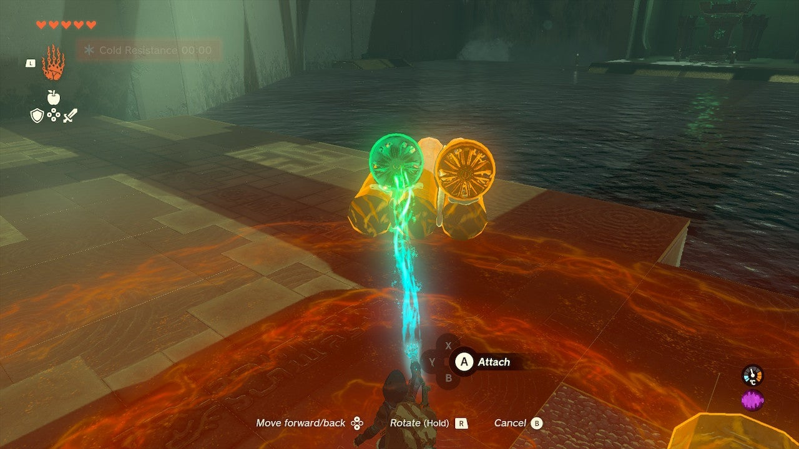{: style="width: 100%"}
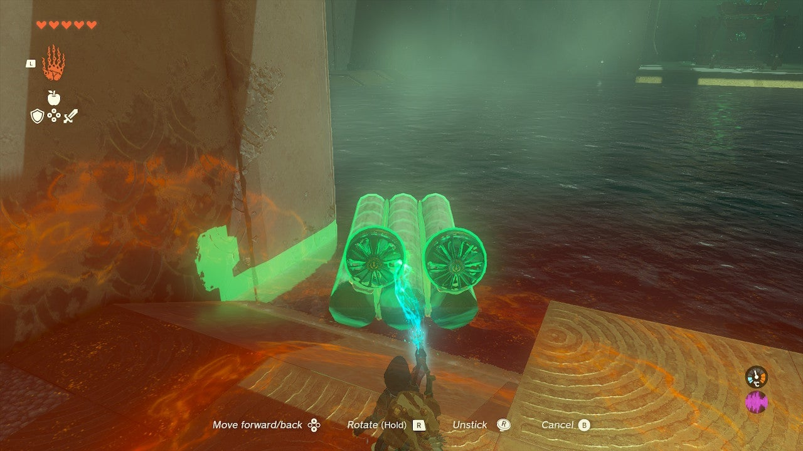{: style="width: 100%"}
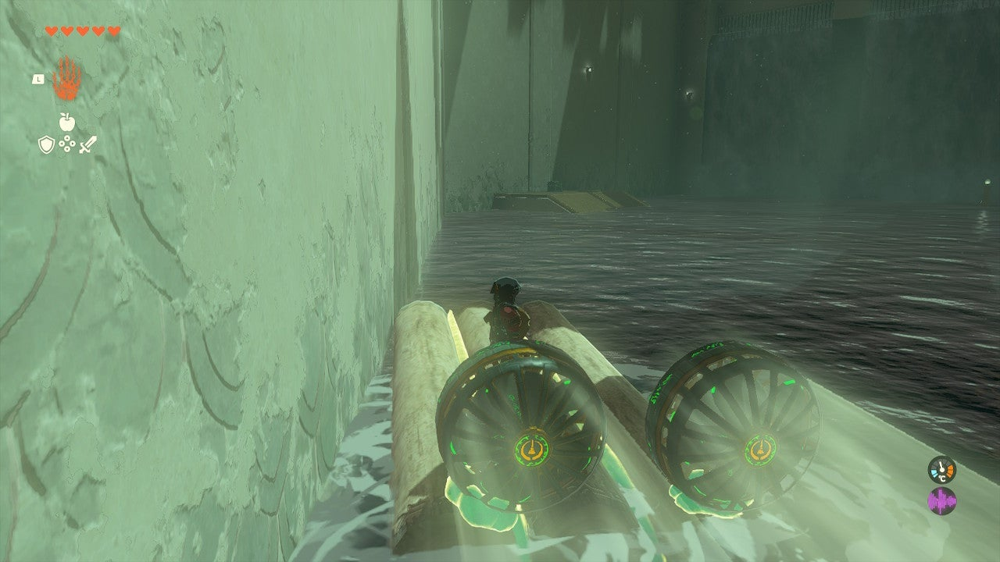{: style="width: 100%"}

5. After getting the treasure, swim directly to the exit. If you struggle against the current, return to your boat and try again. You can overcome the current and make it to the exit with your starting stamina level.

## Treasure Chests

- Spiky Shield: Located on a small island reachable by boat.

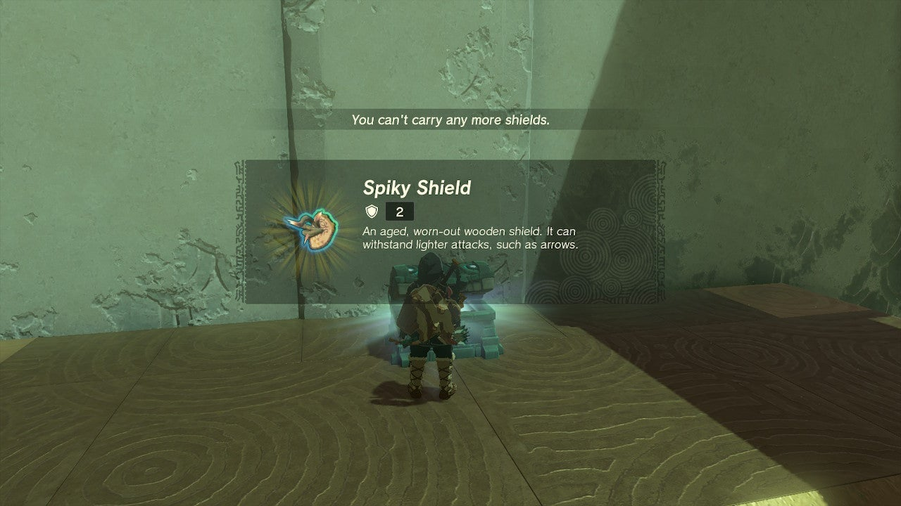{: style="width: 100%"}
