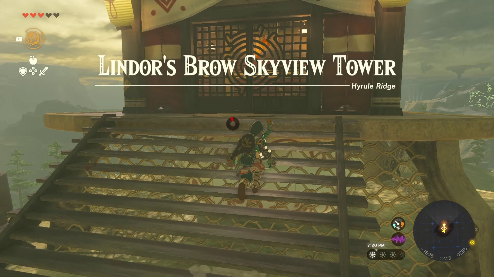
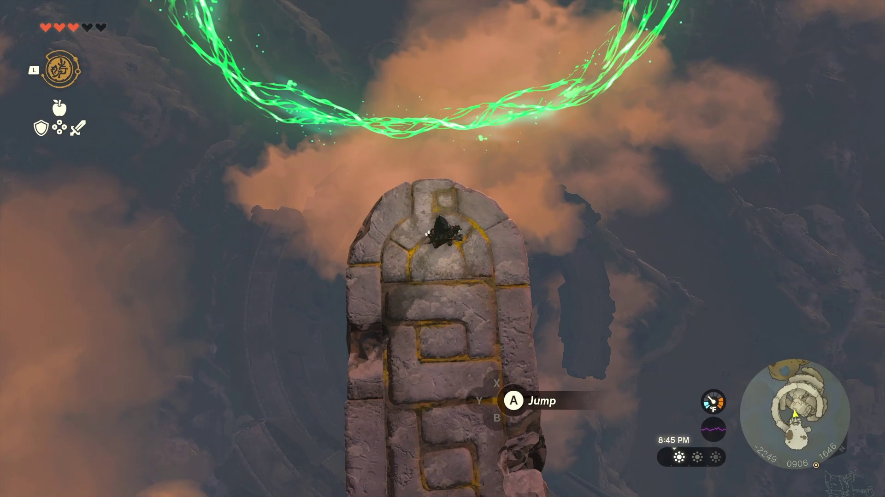
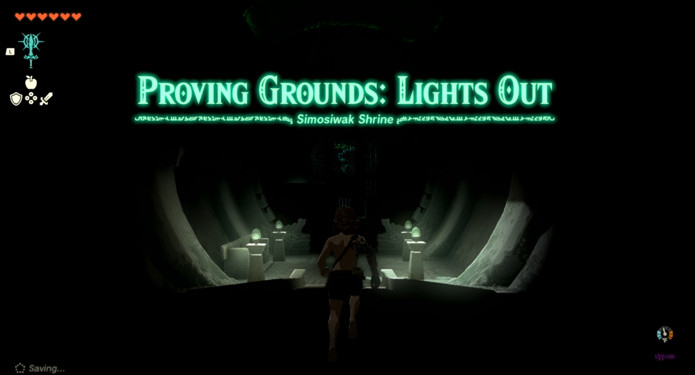
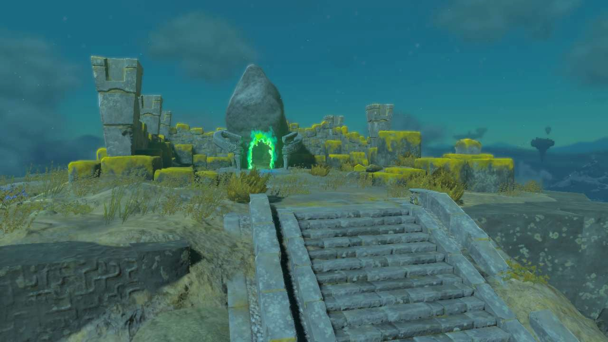
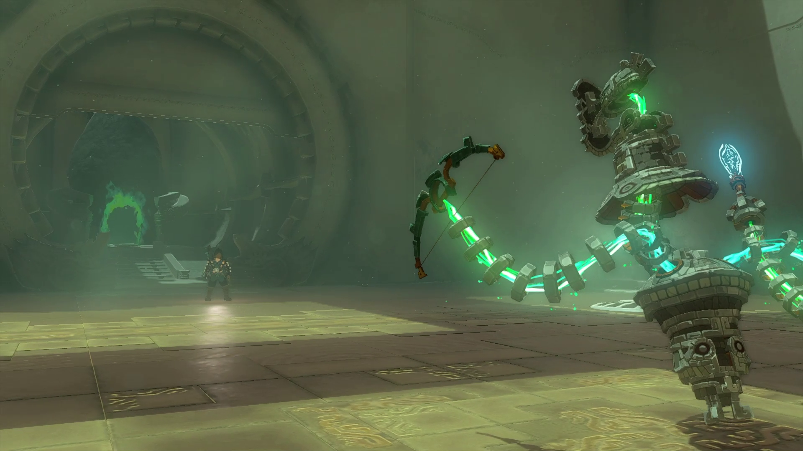
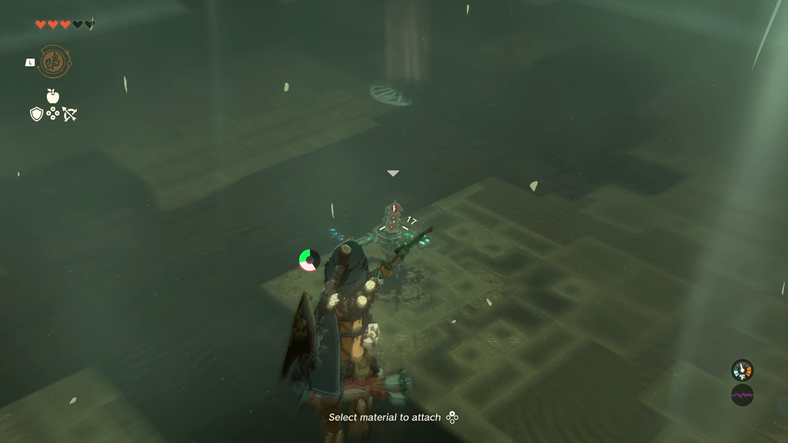
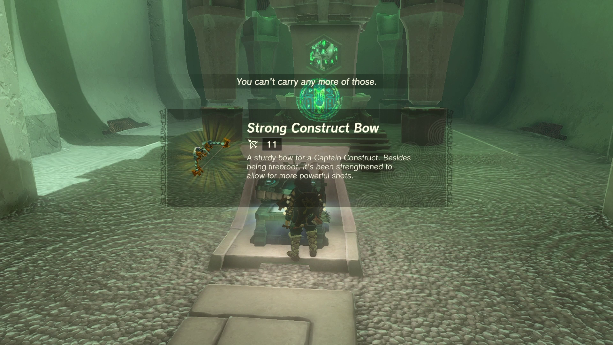

# Taunhiy Shrine

## Location and Introduction

Taunhiy Shrine, also known as Combat Training: Archery, is a shrine located in the Central Hyrule Sky. To find Taunhiy Shrine, you need to travel to a Sky Island in Central Hyrule Sky. From Lindor's Brow Skyview Tower, launch into the air and activate your paraglider. Look for a green hand field and activate it to initiate a falling rings puzzle. Leap off the edge of the island and guide Link through all the rings. If you miss a ring, land in the water or on the island with the water, and speak to the Zonai construct who will warp you back to the top for another attempt. Upon successfully completing the rings, the shrine will appear on the sky island near the construct.

{: style="width: 100%"}
{: style="width: 100%"}
{: style="width: 100%"}
{: style="width: 100%"}

## Puzzle Solutions

1. Once inside Taunhiy Shrine, you will face a combat trial that focuses on archery skills.

{: style="width: 100%"}

2. Jump onto an updraft of air by pressing Y and quickly press Y again to glide and move upwards on the draft.

3. Use the RIGHT TRIGGER to aim your bow, activating a slow-motion mode that consumes stamina.

{: style="width: 100%"}

4. Aim at the Zonai construct and release the arrow to hit it.

5. After hitting the construct once, a second challenge will be presented.

6. Repeat the process, utilizing the updraft and aiming at all three robots in sequence.

7. The slow-motion effect will greatly assist you, and if you are using motion controls, you can further fine-tune your shots.

8. Hit all three targets to conclude the challenge.

## Treasure Chests

Strong Construct Bow: Before leaving Taunhiy Shrine, don't forget to claim your reward from the treasure chest located near the exit. Additionally, make sure to collect any Zonite and other loot dropped by the three constructs.

{: style="width: 100%"}
