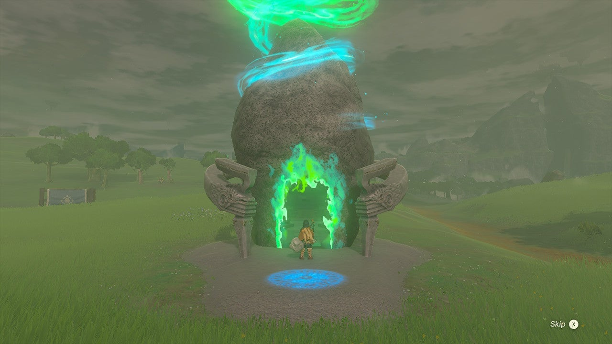
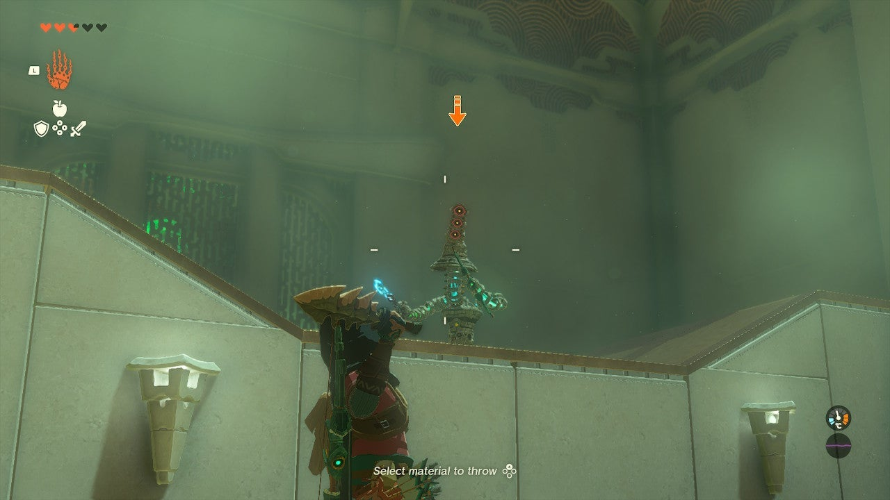
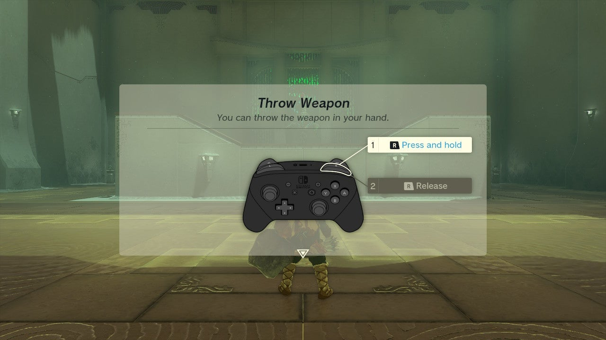
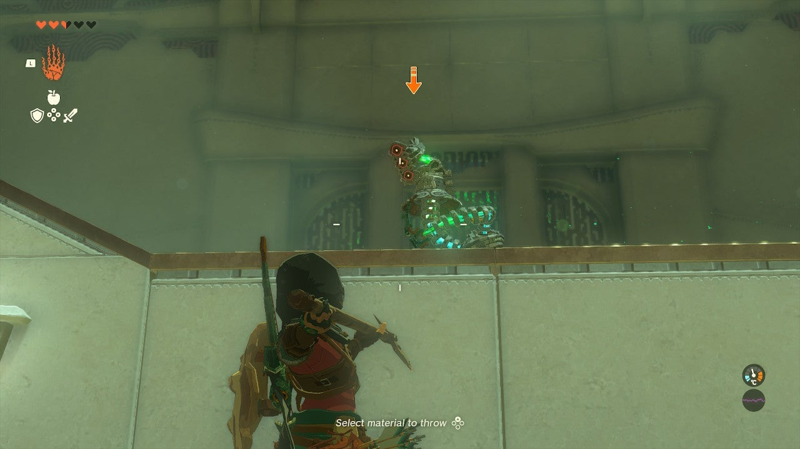
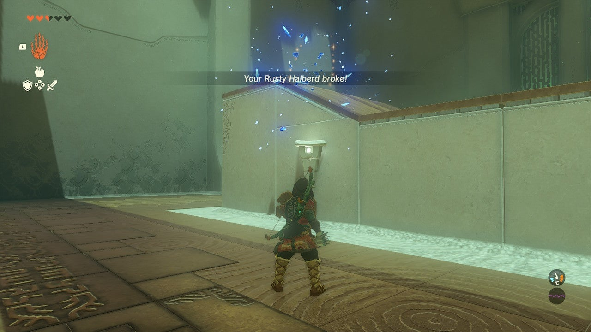

# Teniten Shrine

## Location and Introduction

Locate the shrine on the surface in Central Hyrule, south and slightly east of Lookout Landing. It can be found east of a small lake called Lake Kolomo.

{: style="width=100%"}

## Puzzle Solutions

1. The shrine features a single construct on a platform that cannot be damaged except by following the tutorial instructions.
2. Explore the enemy platform and check the rear side for dropped weapons and Zonai Charge. Collect all the items before proceeding.
3. The treasure for this shrine can be found in a chest near the exit. Open the chest to reveal its contents.

{: style="width=100%"}
{: style="width=100%"}
{: style="width=100%"}
{: style="width=100%"}

## Treasure Chests

- Zonaite Spear: Located in a chest near the shrine's exit.
