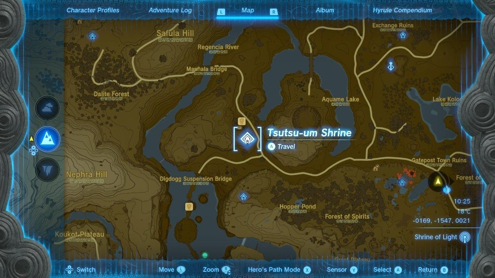
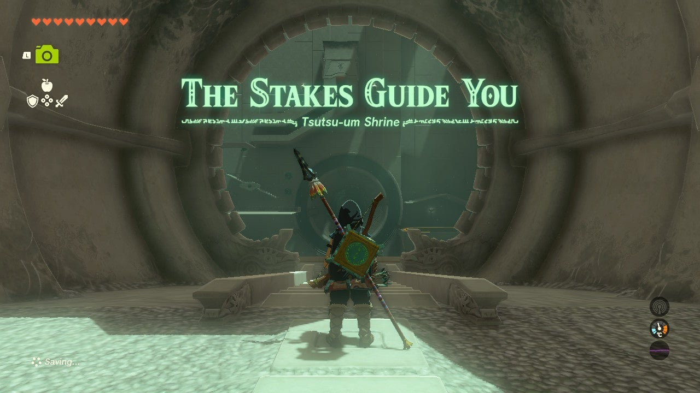
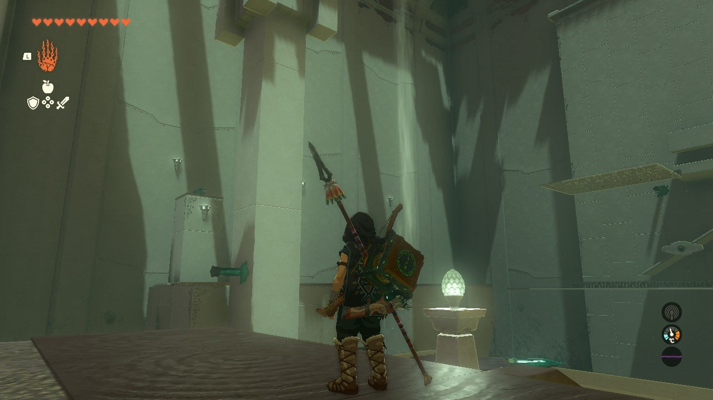
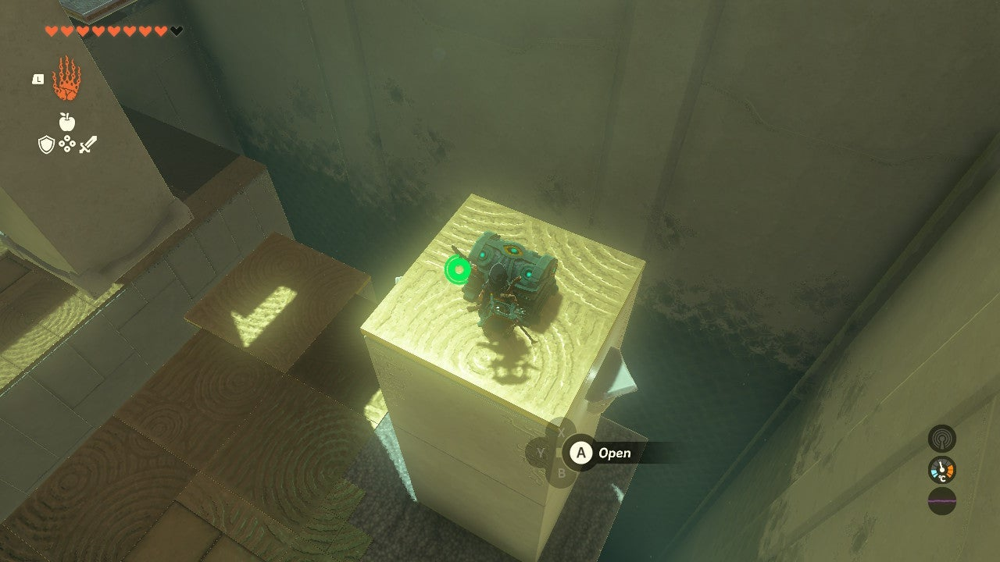
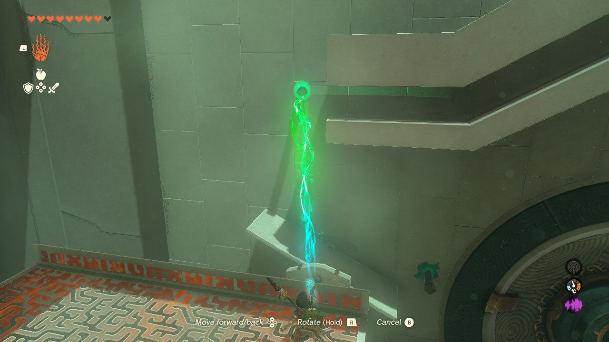
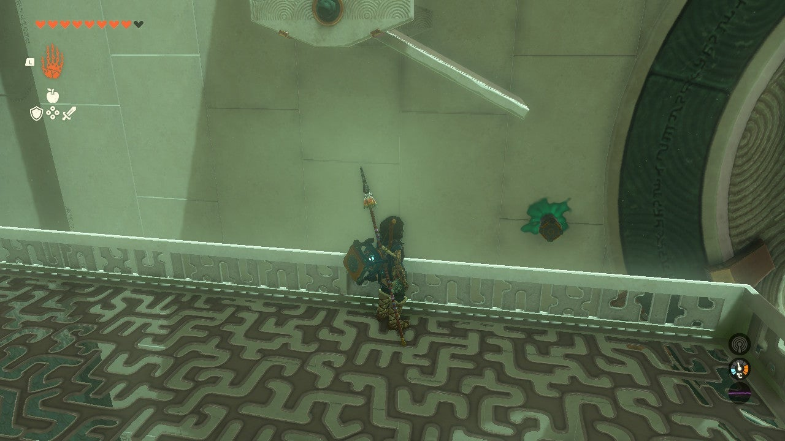
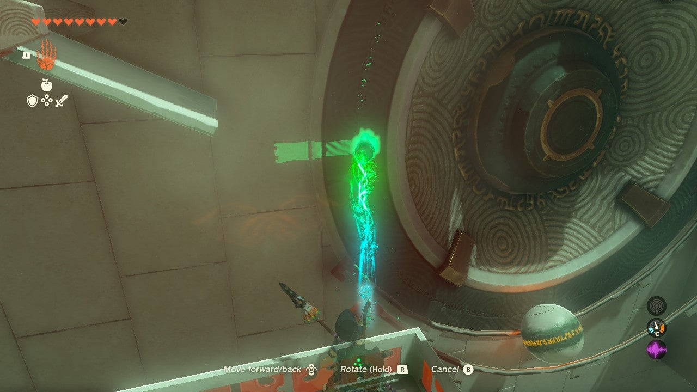
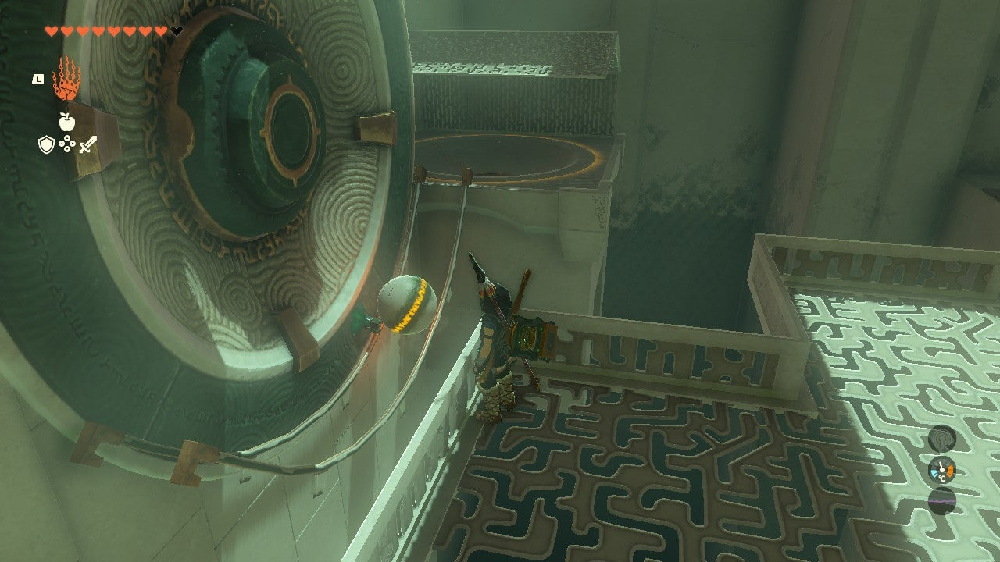

# Tsutsu-um Shrine

## Location and Introduction

Tsutsu-um Shrine is a shrine located in the Central Hyrule Region on a hill to the south of the Outskirts Stable.

{: style="width: 100%"}
{: style="width: 100%"}

## Puzzle Solutions

1. Upon entering the shrine, you'll find yourself in a large room with two sides. The main puzzle that needs to be solved is straight ahead, which involves getting a constantly falling ball into its port on the lower right.

{: style="width: 100%"}

2. On the left side of the room, you'll find auxiliary tools and the shrine's treasure chest. Start by heading towards the left side to collect the treasure chest. To reach it, use the stakes provided in the opening platform. These stakes can be used to stick structures into various surfaces.
3. Grab the longer metal platform using Ultrahand and look towards the moving pillar. Wait until the pillar moves all the way down and stops. Attach the metal platform to the beam sticking out of the pillar, then hop on it. Cross to the left structure using the air current and glide over to the treasure chest. Inside, you'll find x5 Arrows.

{: style="width: 100%"}

4. Return to the main puzzle structure and glide up to the high white metal platform in front of it.
5. The first step is to gain control of the falling ball. Use one of the stakes from the wall as a stopper by placing it in front of the spot where the ball falls from its initial slide.

{: style="width: 100%"}

6. Next, ensure that the ball is directed towards the port. Place another stake from the wall under the moving white seesaw platform when the left side is in the air and the right side is down. This will guide the ball towards the port, but don't drop it yet.

{: style="width: 100%"}

7. Utilize the remaining stake to act as a stopper for the ball when it drops. Position it slightly below the right side of the white seesaw. This will help push the ball onto the metal track near the spinning wheel.

{: style="width: 100%"}

8. Release the ball and let it fall onto the metal tracks. Adjust as needed to ensure it stops on the tracks before reaching the wheel. To automate the process, move the stake that was blocking the ball just to the left of it, allowing it to slowly release whenever it's ready to drop again.
9. Once the ball is on the metal track, take the nearest spike and place it halfway on the grey part of the spinning wheel. This will gently push the ball towards its port.

{: style="width: 100%"}

10. With the ball successfully in the port, the gate to the exit will open.

## Treasure Chests

- Arrows (x5): Found in the shrine's treasure chest on the left side of the main puzzle structure.
