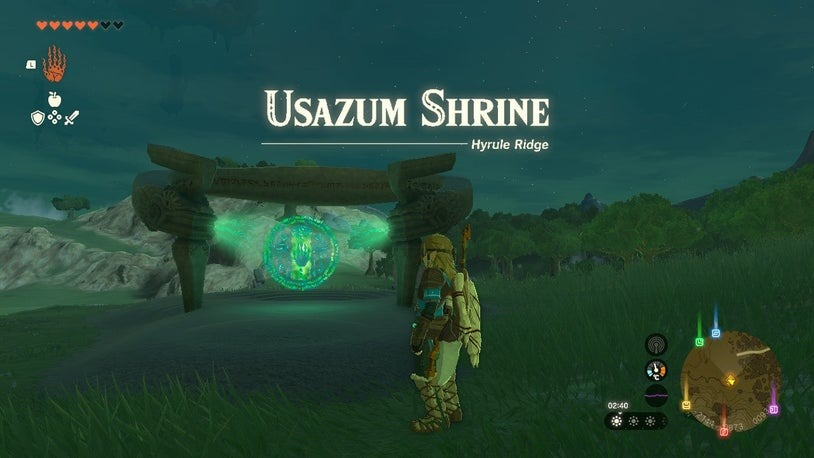

# Usazum Shrine

## Location

Usazum Shrine is located in the Hyrule Ridge. The shrine is absent, but you can find the partial shrine ring empty on the field west of Safula Hill and north of the Dalite Forest. In this shrine quest, you are tasked with retrieving a crystal and presenting it at the shrine. A light emits from the shrine, pointing the way to the crystal.

{: style="width:100%"}
## Treasure Chests

There are no specific treasure chests mentioned for Usazum Shrine.

## Puzzle Solutions

The main challenge in Usazum Shrine is defeating the Hinox. To reach the crystal, you need to enter a dark hole at the base of Satori Mountain, which leads to a cave. Inside the cave, you will see the crystal's ray bobbing around. However, the crystal is located around the neck of the Hinox.

Before facing the Hinox, it is recommended to have arrows. Defeat the Hinox and take the crystal. Before leaving the cave, check the northernmost corner where you can climb up and find a hidden alcove containing a treasure.

Once you have the crystal, return to the shrine spot and place it there to gain access to the shrine. Inside, you will receive Rauru's Blessing. Simply walk forward, collect the treasure (Strong Zonaite Spear), and exit the shrine with a new Light of Blessing.
