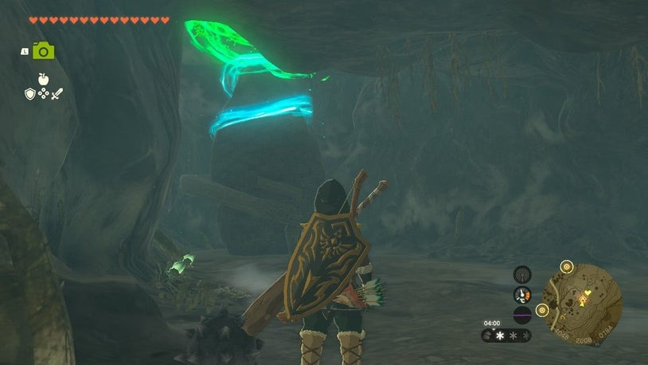
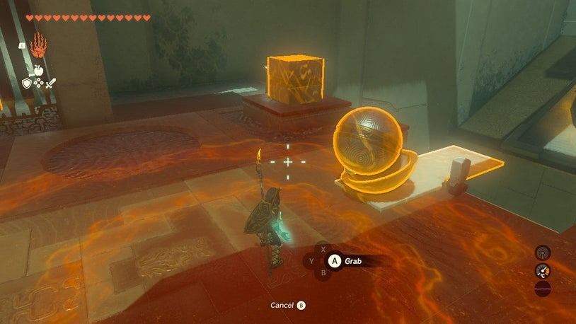

# Wao-os Shrine

## Location and Introduction
Wao-os Shrine (Lever Power) in The Legend of Zelda: Tears of the Kingdom is a shrine located under the Passer Hill area in the Region. The shrine's cave entrance is above the road west of Lake Totori. You can easily find it by visiting the cherry blossom tree shrine on Passer Hill. The coordinates for the cave entrance are -3951, 2033, 0201.

{: style="width:100%"}
{: style="width:100%"}
{: style="width:100%"}

## Puzzle Solutions

1. Before completely exiting to the next big cavern, stop when the ceiling gets higher and you see a regular ore deposit. Look right (or northward) and up to find an opening in the wall. Climb up to discover a hidden cavern with a Bubbulfrog and some mushrooms. Shoot the Bubbulfrog down with an arrow and collect the Bubbul Gem.
1. Enter the shrine and drop down from the entry tunnel into a cavern with a pond. Collect Sticky Lizard, Chillfin Trout, Glowing Cave Fish, Brightcap, and Chilishroom here.
2. Climb up the cavern's natural ramp on the left to proceed.

{: style="width:100%"}

3. Past the ore deposit, you'll find the shrine. The goal is to fling an iron ball into a bowl and hit the big target to open a gate.
4. Use Ultrahand to put the iron ball into the bowl and fuse them. Place them on the ground side of the white slab seesaw.

{: style="width:100%"}
{: style="width:100%"}

5. Pick up the iron box and lift it high above the half of the white slab hanging over the chasm. Drop the box and the bowl-ball combo will fling to the other side, hitting the big target. The gate opens, granting access to a wooden platform.
6. Attach the wooden platform to the ground side of the white slab seesaw, covering only the ground half.

{: style="width:100%"}
7. Stand on the wooden plank and use Ultrahand to pick up the box again. Raise it high over the other half of the white slab and drop it to get flung into the air.
8. Glide using the glider towards the entrance and land on the platform where the treasure chest is located. Open it to obtain a Spicy Elixir.
9. Return to the main platform to finish the puzzle.
10. If a piece gets stuck, you can glide across and throw it into the chasm.
11. To exit the shrine, leave the wood platform where it is. Attach the bowl to the wood platform on its forward horizontal plank, almost at the middle of the extended structure.
12. Place the iron ball (do not attach it) into the bowl. Use the iron box to fling the ball forward, hitting the higher target and opening the way out.
13. Stand on the wood platform and use your glider to cross the gap.
14. With the path open, you can exit the shrine.

## Treasure Chests
- Inside the shrine, after completing the puzzle, there is a treasure chest containing a Spicy Elixir on a platform.

{: style="width:100%"}